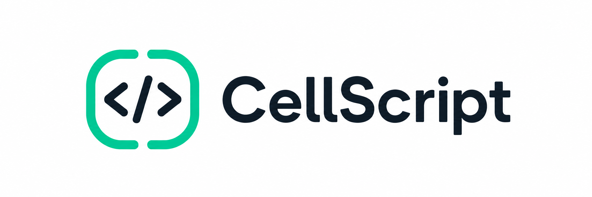
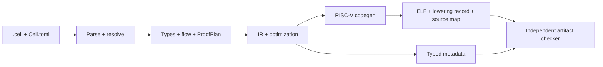

<p align="center">
  
</p>

[](https://github.com/CellScript-Labs/CellScript/actions/workflows/ci.yml)
[](https://github.com/CellScript-Labs/CellScript/releases/tag/v0.31.0)
[](LICENSE-MIT)
[](Cargo.toml)
[](https://github.com/CellScript-Labs/CellScript/wiki)

**Write Cell contracts the way you think about them — not the way the wire format does.**

CellScript is a domain-specific language for Cell-based smart contracts on
CKB. It compiles `.cell` source into ckb-vm RISC-V assembly or ELF artifacts,
together with typed metadata for auditing, policy checks, schema binding, and
scheduler-aware execution.

[Quick start](#quick-start) · [Example](#example) ·
[Package workflow](#package-workflow) · [Documentation](#documentation) ·
[Development](#development)

## Current Status

The published release is
[CellScript v0.31.0](https://github.com/CellScript-Labs/CellScript/releases/tag/v0.31.0).
It improves generated-code costs while retaining the 0.30 source-language and
witness boundaries. The [release notes](docs/releases/CELLSCRIPT_0_31_RELEASE_NOTES.md)
record validation results and the maintainer-authorized exception for pending
review and release-evidence records; publication does not imply a passed full
release gate or fresh public-network deployment.

The `0.32` branch contains unreleased cost and experimental ZK work. Workspace
versions remain 0.31.0 until coordinated release preparation. See
[branch context](BRANCHES.md) and the [changelog](CHANGELOG.md) for the distinction
between published artifacts and development work.

CellScript remains in a CKB-focused alpha / stabilisation phase. It supports
contract authoring, bundled examples, metadata inspection, local tooling, and
bounded integration testing. Mainnet use still requires application-specific
review and transaction evidence. Compiler checks, independently checked
artifacts, CKB-VM execution, and chain acceptance are separate evidence levels.

## Why CellScript

CellScript makes Cell state and transaction effects explicit in source:

- **Linear assets:** resources and receipts must reach an explicit lifecycle
  or output-binding role; they cannot be silently copied or dropped.
- **Typed state:** schemas describe asset data, shared state, receipts, and
  input/output relationships.
- **Visible effects:** `consume`, `create`, `destroy`, and successor relations
  feed metadata, ProofPlan obligations, and policy checks.
- **Inspectable artifacts:** ELF builds include metadata, a canonical lowering
  record, and a source map for an independent artifact checker.
- **CKB execution:** generated artifacts run in CKB-VM, with explicit Script,
  witness, CellDep, capacity, and authorization boundaries.

## Quick Start

Install the latest published binary:

```bash
curl -fsSL https://github.com/CellScript-Labs/CellScript/releases/latest/download/install.sh | sh
```

To pin the release described here:

```bash
curl -fsSL https://github.com/CellScript-Labs/CellScript/releases/download/v0.31.0/install.sh | CELLSCRIPT_VERSION=0.31.0 sh
```

Follow the installer's PATH instructions. Release archives have accompanying
`SHA256SUMS` on the release page.

Create and build a package without a source checkout:

```bash
cellc new token_package
cd token_package
cellc check
cellc build --target riscv64-elf --target-profile ckb
```

To try the bundled examples, clone the matching release in a separate directory
and run the commands from its root:

```bash
git clone --branch v0.31.0 --depth 1 https://github.com/CellScript-Labs/CellScript.git
cd CellScript

# Compile a bundled contract to RISC-V assembly (the default)
cellc examples/token.cell

# Compile one NFT action under the CKB assurance gate
cellc examples/nft.cell --target riscv64-elf --target-profile ckb --primitive-strict 0.16 --entry-action transfer

# Inspect its metadata and policy constraints
cellc metadata examples/nft.cell --target-profile ckb
cellc constraints examples/nft.cell --target-profile ckb
```

For source builds and repository checks, see [Development](#development).

## Core Model

Programs express verifier constraints over proposed Cell transformations.
Transactions provide the input and output Cells; the compiled Script checks
that they satisfy the declared rules.

| Construct | Meaning |
|---|---|
| `resource T { ... }` | A linear Cell-backed asset |
| `shared T { ... }` | Shared state read from a CellDep or updated through Cell replacement |
| `receipt T { ... }` | A single-use proof Cell |
| `consume value` | Bind a lifecycle effect to a spent input Cell |
| `create output = T { ... }` | Constrain a proposed output Cell and its typed data |
| `read param: T` / `read_ref<T>()` | Read a CellDep-backed value |
| `action` | Type Script transition logic |
| `lock` | Lock Script authorization logic |
| Local `let` values | Transaction-local computation |

Local values do not become persistent Cells implicitly. A `create` statement
constrains a transaction output; the transaction builder supplies that output.
Stdlib lifecycle patterns such as `std::lifecycle::transfer` and
`std::receipt::claim` expand into explicit effects. See the
[standard library tutorial](docs/wiki/Tutorial-10-Standard-Library.md) and
[linear ownership contract](docs/CELLSCRIPT_LINEAR_OWNERSHIP.md).

## Example

This transfer entry preserves a token's amount and symbol while constraining
its successor's Lock Script hash:

```cellscript
module ckb::fungible_token

resource Token has store, create, consume, replace, burn, relock {
    amount: u64,
    symbol: [u8; 8],
}

action transfer_token(token: Token, to: Address) -> next_token: Token {
    verification
        consume token
        create next_token = Token { amount: token.amount, symbol: token.symbol } with_lock(to)
}
```

The input Cell's Lock Script supplies spending authorization. The full
[token example](examples/token.cell) adds guarded minting, burning, and merging.

| Bundled example | What it shows |
|---|---|
| [Token](examples/token.cell) | Mint, transfer, burn, guarded same-symbol merge |
| [Timelock](examples/timelock.cell) | HeaderDep timepoints and normal/emergency release paths |
| [Multisig](examples/multisig.cell) | Non-cryptographic threshold approvals; custody remains the surrounding Lock Script's responsibility |
| [NFT](examples/nft.cell) | Collection-bound assets, ownership transfer, typed Token settlement |
| [Vesting](examples/vesting.cell) | Receipt-style grants, partial claims, terminal full claims |
| [AMM pool](examples/amm_pool.cell) | TypeHash-bound shared pool state and swap/liquidity effects |
| [Launch](examples/launch.cell) | Mint-authority bootstrap and launch/pool composition |

The [language examples](examples/language/README.md) cover additional compiler
and tooling surfaces. They are separate from the seven bundled contracts in
the CKB production acceptance matrix. For their business flows, see the
[example guide](docs/wiki/Tutorial-08-Bundled-Example-Contracts.md).

## Target Profiles

`ckb` is the supported target profile; executable outputs are `riscv64-asm`
and `riscv64-elf`. The profile applies CKB syscall, Molecule, BLAKE2b, and
runtime-policy checks. `--primitive-strict 0.16` selects the current primitive
assurance gate, including mandatory ProofPlan soundness checks. Its version is
independent of the compiler release.

Unsupported runtime shapes fail closed. A metadata declaration or ProofPlan
record does not by itself mean that an executable verifier exists. Consult the
[collections support matrix](docs/CELLSCRIPT_COLLECTIONS_SUPPORT_MATRIX.md),
[CKB runtime-view matrix](docs/CELLSCRIPT_0_30_CKB_RUNTIME_VIEW_MATRIX.md), and
[metadata verification tutorial](docs/wiki/Tutorial-06-Metadata-Verification-and-Production-Gates.md)
for precise coverage.

The browser compiler in `crates/cellscript-wasm` exposes metadata-only
compilation. It does not emit ELF. The separate `src/wasm` audit scaffold
rejects executable entries; CellScript has no production Wasm artifact backend.

## Package Workflow

`Cell.toml` declares source semantics, compiler requirements, entry points, and
build defaults. A minimal manifest is:

```toml
[package]
edition = "2026"
name = "token"
version = "0.1.0"
cellscript_version = ">=0.31.0"
entry = "src/main.cell"
source_roots = ["src"]

[build]
target = "riscv64-elf"
target_profile = "ckb"
```

Edition 2026 is the stable default. Packages must declare an edition explicitly.
The compiler also recognizes the opt-in, bounded Edition 2027 contract under
`cellscript-source-semantics-2027-0.30-v1`; it does not freeze the wider 1.0
grammar. Source edition, compiler version, target profile, assurance mode,
metadata schemas, and witness ABIs remain independently versioned. See the
[edition policy](docs/CELLSCRIPT_EDITION_POLICY.md).

`cellc migrate path/to/package --to 2027` produces a review-only candidate for
its supported subset only after matching `CoreSemanticId` and generated ELF
bytes. It does not edit source, manifests, or locks. The
[2027 grammar](docs/CELLSCRIPT_2027_PREVIEW_GRAMMAR.md) defines retained native
`type_script` / `lock_script` forms and their deferred boundaries.

Packages support local, Git, and Registry source dependencies, explicit
workspace members, features, and chain-bound environments. Each selected graph
admits one exact version/source/feature/environment instance per package
coordinate. Incompatible instances fail instead of being silently combined.

Commit `Cell.lock` to version control. Its v5 graph is authoritative for
`build`, `check`, and `test`; these commands do not select new dependency
versions. `--frozen` also forbids network access and lockfile writes.

| Task | Command |
|---|---|
| Add a local dependency | `cellc add shared-types --path ../shared-types` |
| Intentionally resolve and pin the graph | `cellc lock` |
| Build workspace members in dependency order | `cellc build --workspace` |
| Inspect the pinned graph or build units | `cellc resolve-graph` / `cellc build-plan` |
| Review a candidate dependency upgrade | `cellc update-plan` or `cellc update` |
| Apply a reviewed lock replacement | `cellc update --apply-plan FILE` |
| Execute package scenarios | `cellc test --backend simulator\|ckb-vm\|all` |
| Discover and compile tests without execution | `cellc test --no-run` |

Registry resolution admits accepted CellScript source-package versions and
verifies immutable snapshots and source identities. Non-CellScript artifact
profiles are discovered through their explicit artifact commands, not ordinary
dependency resolution. Bare `cellc publish` is an authenticated public Registry
write; `--offline` selects the local flow. For interactive first publication,
`cellc publish --authorise` opens the browser authorization flow and resumes
publishing with the resulting delegated credential. See the
[package tutorial](docs/wiki/Tutorial-04-Packages-and-CLI-Workflow.md),
[transactional upgrade contract](docs/CELLSCRIPT_TRANSACTIONAL_UPGRADES.md), and
[Registry boundary](docs/CELLSCRIPT_REGISTRY_PRODUCTION_BOUNDARY_ADR.md).

## Architecture



The compiler lives in `src/`. `crates/cellscript-artifact-checker` checks the
ELF, `.elf.meta.json`, `.elf.lowering.json`, and `.elf.sourcemap.json` as one
bundle without loading the compiler frontend or code generator.

Keep these evidence levels separate:

- **Compiler checks:** source typing, Cell effects, target policy, and verifier
  obligations.
- **Artifact checks:** identity binding, static structure, source-map and
  lowering-record agreement. These do not prove complete source-to-machine
  semantic equivalence or VM execution.
- **Execution and chain evidence:** exact transaction shape, witnesses,
  capacity, cycles, accepted/rejected spends, and observed chain inclusion.
  Simulator evidence is non-consensus; CKB-VM evidence alone is not deployment.

The [artifact boundary](docs/CELLSCRIPT_VERIFIED_ARTIFACT_BOUNDARY.md) and
[gate policy](docs/CELLSCRIPT_GATE_POLICY.md) define the required evidence.

## Editor Support

`cellc --lsp` serves diagnostics, completion, hover, definitions, references,
formatting, and code actions over stdio. The
[VS Code extension](editors/vscode-cellscript) adds snippets and compiler-backed
build, metadata, builder, Registry, and audit workflows.

The extension is a Git submodule. Initialize it before building or packaging:

```bash
git submodule update --init editors/vscode-cellscript
```

The `cellscript-mcp` binary exposes read-only compiler reports to MCP clients;
see the [agent tooling tutorial](docs/wiki/Tutorial-13-Agentic-Loops-and-cellscript-mcp.md).

## Integrations

- **CKB builders:** [`cellscript-ckb-adapter`](docs/CELLSCRIPT_CKB_ADAPTER.md)
  materializes transaction plans and carries explicit signing, submission, and
  confirmation evidence. Generated TypeScript builders share the
  [ProtocolBundle contract](docs/CELLSCRIPT_PROTOCOL_BUNDLE.md).
- **Fiber:** the [bounded no-profile adapter](examples/fiber/README.md) supports
  explicitly eligible fungible assets. Its local CKB-VM and bounded devnet
  results do not establish general Fiber support or production readiness.
- **Spore and RGB++:** [identity-adapter cookbook packages](docs/wiki/Spore-and-RGBPP-Interop-Boundaries.md)
  remain non-production and do not move those protocols into the core language.
- **External verifiers:** [trusted verifier composition](docs/CELLSCRIPT_TRUSTED_EXTERNAL_VERIFIERS.md)
  pins exact dependencies and ABIs. The compiler does not prove external code's
  internal correctness.

## Reference

The CLI's built-in `cellc --help` and `cellc <command> --help` describe arguments.
Frequently used reports and tools include:

| Command | Purpose |
|---|---|
| `cellc metadata` / `expand` / `constraints` | Inspect semantic facts, canonical expansion, and policy constraints |
| `cellc abi` / `entry-witness` | Inspect or encode the entry witness ABI |
| `cellc action build` / `gen-builder --target typescript` | Generate builder contracts and TypeScript packages |
| `cellc scheduler-plan` / `explain assumptions` | Inspect access summaries and builder obligations |
| `cellc tx validate` / `tx solve` | Check transaction shape or generate a transaction template |
| `cellc deploy plan` / `deploy verify` | Plan or verify deployment identity |
| `cellc verify-artifact` | Independently check the complete ELF bundle |
| `cellc profile` / `opt-report` / `audit-bundle` | Inspect cost, optimization, and audit reports |
| `cellc fmt` / `doc` | Format source or generate documentation |
| `cellc package verify` / `registry verify` | Verify package or deployment identities |
| `cellc artifact ls-idl validate\|bind\|fetch\|bundle` | Work with byte-exact Lock Script interfaces |

`--json` writes a machine-readable result to stdout for both success and
failure. Deployment-oriented policy options include `--production`,
`--deny-fail-closed`, `--deny-ckb-runtime`, and `--deny-runtime-obligations`.
See the [compiler diagnostics](docs/CELLSCRIPT_COMPILER_ERROR_CODES.md) and
[runtime errors](docs/CELLSCRIPT_RUNTIME_ERROR_CODES.md) for stable codes.

## Documentation

- [Tutorials](docs/wiki/Home.md) and [documentation map](docs/README.md)
- [Entry witness ABI](docs/CELLSCRIPT_ENTRY_WITNESS_ABI.md) and
  [persistent-policy witness ABI](docs/CELLSCRIPT_POLICY_WITNESS_ABI.md)
- [Output bindings](docs/CELLSCRIPT_OUTPUT_BINDINGS.md) and
  [capacity / builder contract](docs/CELLSCRIPT_CAPACITY_AND_BUILDER_CONTRACT.md)
- [Executable package scenarios](docs/CELLSCRIPT_EXECUTABLE_TEST_SCENARIOS.md)
- [LS-IDL for Lock Scripts](docs/wiki/Tutorial-15-LS-IDL-for-CKB-Lock-Scripts.md)
- [Release history](CHANGELOG.md) and [release records](docs/releases/)
- Historical compatibility boundaries: [0.23 release notes](docs/releases/CELLSCRIPT_0_23_RELEASE_NOTES.md)
  and [0.24 release notes](docs/releases/CELLSCRIPT_0_24_RELEASE_NOTES.md)

## Development

Read [CODING_STYLE.md](CODING_STYLE.md) before changing compiler or documentation
contracts. Use [BRANCHES.md](BRANCHES.md) to select the appropriate release or
development line.

Source builds use the pinned Rust 1.97.1 toolchain and a sibling
`../ckb-sdk-rust` checkout at tag `v5.1.0`. Initialize the repository submodules
for integration fixtures, editor, and website work:

```bash
git submodule update --init
cargo build --locked -p cellscript --bin cellc

# Local validation before committing or pushing
./scripts/cellscript_gate.sh dev

# CI parity before claiming merge readiness
./scripts/cellscript_gate.sh ci

# Required for IR / codegen / assembler / ABI / ELF changes
./scripts/cellscript_gate.sh backend
```

The [gate policy](docs/CELLSCRIPT_GATE_POLICY.md) lists tooling prerequisites
and coverage, including the additional CKB/NovaSeal requirements for release
gates. Focused checks do not replace the matching unified gate.

## License

[MIT](LICENSE-MIT), as declared in [Cargo.toml](Cargo.toml).
