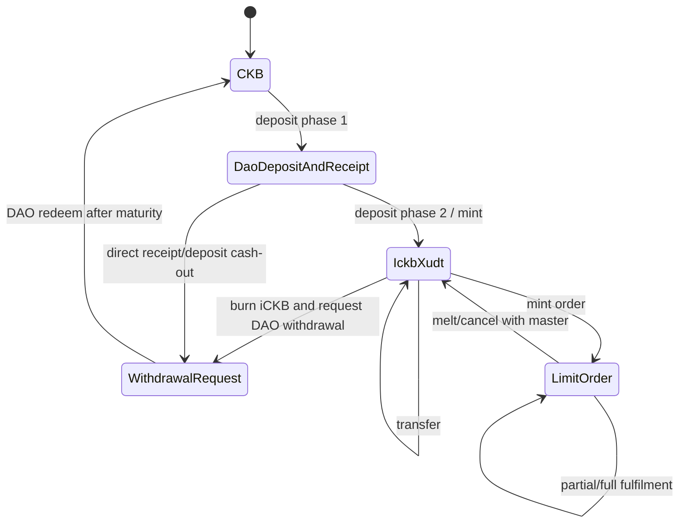

# iCKB Protocol Semantics Extracted For CellScript Benchmark

This document extracts the subset of iCKB semantics used by the CellScript
benchmark. Source references point to iCKB v1-core commit
`f7bbf7fe691d449a68a4b973d3102b7af28b2c9b` and proposal commit
`055f0cb2c44b2988531c241a6f7167397bbe42c7`.

## State Machine

## Cell And Action Table

| Item | Semantics | Original references |
|---|---|---|
| DAO deposit controlled by iCKB Logic | DAO deposit data must be 8 zero bytes, type is DAO, lock is iCKB Logic. | Proposal `README.md:206-215`; `ickb_logic/src/celltype.rs:68-72`; `utils/src/dao.rs:17-23` |
| iCKB receipt | Type is iCKB Logic; data has quantity and unoccupied capacity. | Proposal `README.md:201-214`; `ickb_logic/src/utils.rs:18-40` |
| iCKB xUDT | xUDT args bind iCKB Logic script hash plus owner-mode input-type flags `0x80000000`. | Proposal `README.md:283-286`; `ickb_logic/src/constants.rs:1-3`; `ickb_logic/src/celltype.rs:116-124` |
| Deposit phase 1 | Output DAO deposits must be matched by receipts grouped by same unoccupied capacity; min/max unoccupied capacity enforced. | Proposal `README.md:182-215`; `ickb_logic/src/entry.rs:86-139` |
| Deposit phase 2 | Input receipts plus input iCKB tokens must equal output iCKB tokens. Header dep must supply the receipt block accumulated rate. | Proposal `README.md:265-286`; `ickb_logic/src/entry.rs:21-36`, `39-83`; `utils/src/utils.rs:54-61` |
| Withdrawal request | Burn iCKB/receipts against input deposits, using accumulated rate from deposit/receipt headers. Proposal says greater-than-or-equal; Rust script enforces exact equality globally. | Proposal `README.md:316-362`; `ickb_logic/src/entry.rs:31-33` |
| Redeem after maturity | DAO second withdrawal is governed by NervosDAO since/header rules; iCKB helper Owned-Owner handles restricted lock shape. | Proposal `README.md:318-334`, `438-505`; `owned_owner/src/entry.rs:41-47` |
| Owned-Owner mint/melt | Every owned withdrawal cell must pair with exactly one owner cell by relative index/metapoint. Script must not be both lock and type in same cell. | Proposal `README.md:450-505`; `owned_owner/src/entry.rs:15-66`, `76-90` |
| Limit Order mint | Output order cell is locked by Limit Order and has UDT type; output master cell has Limit Order as type. | Proposal `README.md:592-637`; `limit_order/src/entry.rs:34-57`, `163-263` |
| Limit Order match | Input and output order info must match; value must not decrease; partial fill must satisfy min match; order cannot mutate after fulfilled. | Proposal `README.md:639-655`; `limit_order/src/entry.rs:86-133` |
| Limit Order melt/cancel | Input order and master must both be consumed and refer to same implicit master metapoint. | Proposal `README.md:685-688`; `limit_order/src/entry.rs:62-80`, `163-207` |

## Critical Invariants

| Invariant | Source logic | Benchmark coverage |
|---|---|---|
| Empty script args for iCKB/Owned-Owner/Limit Order script uses | `has_empty_args` checks current script args and output lock args. `utils/src/utils.rs:14-35` | Model fixture `witness_malformation`; unresolved source/role limitations are tracked in `examples/ickb_benchmark/limitations.json` |
| DAO deposit receipt matching | Output deposits counted by unoccupied capacity must equal output receipt quantities. `ickb_logic/src/entry.rs:86-139` | Positive `valid_deposit_phase_1`; negative `forged_receipt` |
| Deposit size bounds | `DepositTooSmall` and `DepositTooBig` at `ickb_logic/src/entry.rs:99-105` | Positive `valid_deposit_phase_1`; negative `capacity_violation` |
| Receipt cannot be empty | `EmptyReceipt` at `ickb_logic/src/entry.rs:111-116` | Model code supports this failure class |
| No unauthorized mint/burn | Exact equation `in_udt + in_receipts == out_udt + in_deposits`. `ickb_logic/src/entry.rs:31-33` | Positives `valid_deposit_phase_2`, `valid_withdrawal_redeem`; negatives `amount_inflation`, `amount_deflation_exact_equality` |
| Correct accumulated rate | `deposit_to_ickb` loads header DAO AR via `extract_accumulated_rate`. `ickb_logic/src/entry.rs:71-83`; `utils/src/utils.rs:54-61` | Negative `wrong_accumulated_rate` is model-level because CellScript has no first-class HeaderDep binding |
| Header dep required | `load_header` fails if header for input/source is absent. `utils/src/utils.rs:54-61` | Negative `missing_header_dep`, model-level |
| xUDT args binding | Script hash computed from xUDT code hash and iCKB Logic hash plus flags. `ickb_logic/src/celltype.rs:116-124` | Positive `valid_ickb_transfer`; negative `wrong_xudt_binding` |
| Script role confusion | iCKB rejects invalid lock/type combinations; Limit Order and Owned-Owner reject cells where script is both lock and type. | Negatives `script_role_confusion`; `script-role-xudt-args` and `limit-order-metapoint-script-role` limitations in `examples/ickb_benchmark/limitations.json` |
| Owned-Owner pair cardinality | For each metapoint, owned and owner counts must both be 1. `owned_owner/src/entry.rs:28-62` | Positive `valid_owned_owner_unlock`; negative `wrong_owner` |
| Limit Order value conservation | `i.ckb * ckb_mul + i.udt * udt_mul <= o.ckb * ckb_mul + o.udt * udt_mul`. `limit_order/src/entry.rs:102-105` | Positive `valid_limit_order_fulfillment`; negative `limit_order_underpayment` |
| Limit Order asset binding | UDT type hash is part of `Info`; input and output info must match. `limit_order/src/entry.rs:86-89`, `244-259` | Negative `limit_order_wrong_asset` |
| Limit Order min partial fill | `InsufficientMatch` checks at `limit_order/src/entry.rs:115-128` | Model-level support |

## Attack Classes

| Attack | Expected original behaviour | Benchmark fixture |
|---|---|---|
| Duplicate receipt / double mint | CKB input uniqueness plus exact accounting should fail duplicate spend attempts. | `duplicate_receipt_double_mint.json` |
| Forged receipt | Output receipt/deposit accounting mismatch fails. | `forged_receipt.json` |
| Wrong owner | Owned-Owner pairing/owner check fails. | `wrong_owner.json` |
| Wrong xUDT type args | iCKB xUDT hash classification fails. | `wrong_xudt_binding.json` |
| Wrong accumulated rate | Header-derived AR mismatch causes amount mismatch/fail. | `wrong_accumulated_rate.json` |
| Redeem before maturity | DAO/Owned-Owner flow must not redeem immature request. | `redeem_before_maturity.json` |
| Amount inflation | Exact accounting fails. | `amount_inflation.json` |
| Amount deflation when exact equality required | Rust script rejects even if proposal withdrawal text suggests `>=`. | `amount_deflation_exact_equality.json` |
| Capacity violation | Deposit bounds fail. | `capacity_violation.json` |
| Script role confusion | Script misuse fails. | `script_role_confusion.json` |
| Limit order underpayment | Value conservation fails. | `limit_order_underpayment.json` |
| Limit order wrong asset | `Info` differs and fails. | `limit_order_wrong_asset.json` |
| Witness malformation | Current scripts avoid witness data; malformed benchmark witness is fail-closed. | `witness_malformation.json` |
| Cell dep substitution | Expected script/cell dep set must be exact. | `cell_dep_substitution.json` |

## Ambiguities

- Proposal withdrawal accounting says input tokens/receipts must be greater than
  or equal to output tokens plus withdrawn deposits, but the Rust iCKB Logic
  script uses exact equality. The benchmark follows the Rust source and records
  this discrepancy as a semantic finding.
- iCKB maturity is mostly delegated to NervosDAO since/header rules and
  Owned-Owner lock shape; the CellScript model only checks an explicit epoch
  predicate.
- Limit Order front-end confusion heuristics described in the proposal are
  off-chain; they are out of scope for executable script equivalence.
