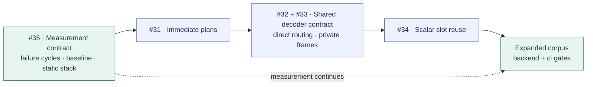

# CellScript 0.31 Cost Decisions

**Status:** accepted implementation decisions, recorded 2026-09-21.
The development implementation and its outstanding acceptance work are recorded
in [the implementation report](CELLSCRIPT_0_31_COST_IMPLEMENTATION.md).

Owner: Arthur, tracked through [#30](https://github.com/CellScript-Labs/CellScript/issues/30)
and its five child issues. Each implementation PR must name its implementer and
a reviewer for the compiler/checker boundary. The 0.30 independent-review waiver
does not automatically apply to 0.31.

## Baseline and scope

Branch `0.31` starts at `8d6e200caa58d81429912df925a9322f691cb41d` on `0.30`.
That commit passed the full local release gate on 2026-09-21. Its GitHub release
and website deployment were still pending at this decision point. The research
comments use `6d75a6e7`; the intervening commits changed reports and release
preparation, not compiler semantics. Preserve both identities in comparisons.

The release objective is lower cost for the existing executable contract.
Keep Edition 2026 as the default and retain the bounded Edition 2027 semantics.
Keep witness tags, envelope formats, accepted input sets, error behavior, and
external-verifier trust boundaries unchanged. No new syntax, compressed
instructions, general register allocator, or wire-envelope redesign belongs in
this cost pass. Creating this branch does not bump Cargo versions, schemas, or
the Rust toolchain. Those changes need their own compatibility changeset.

## Decisions

| ID | Owner issue | Chosen direction | Excluded from the initial implementation |
| --- | --- | --- | --- |
| D1 | [#35](https://github.com/CellScript-Labs/CellScript/issues/35) | Explicit measurement availability; preserve transaction-cycle baselines; add group rejection cycles and static call-chain stack bounds | Zero-valued failure placeholders; universal worst-case claims |
| D2 | [#31](https://github.com/CellScript-Labs/CellScript/issues/31) | One deterministic immediate plan, signed 12-bit decomposition, coalesced shifts, existing ISA | ADDIW/ISA expansion; changing the fixed entry trampoline |
| D3 | [#32](https://github.com/CellScript-Labs/CellScript/issues/32) | Share exact decoder layouts behind direct action stubs; keep linear tag dispatch | Jump tables, indirect action calls, an invented dispatch threshold |
| D4 | [#33](https://github.com/CellScript-Labs/CellScript/issues/33) | Size private adapter frames from proven needs; keep argument ownership and outer loading capacity | Borrowed argument spans and outer normalization-copy removal |
| D5 | [#34](https://github.com/CellScript-Labs/CellScript/issues/34) | Centralize scalar addresses, then deterministic CFG-liveness slot reuse | General register allocation and helper-scratch reuse |
| D6 | [#30](https://github.com/CellScript-Labs/CellScript/issues/30) | Preserve wire ABI; version changed lowering/checker contracts together; review each metric separately | Reusing old machine evidence after an ELF change |

### D1 — Establish useful measurements first

The existing runner records zero cycles when transaction verification fails.
That value is unavailable evidence. It must never satisfy a rejection budget.

Use the pinned `TransactionScriptsVerifier::detailed_run` path to measure
ordinary nonzero exits for the exact selected Script group. Keep the ordinary
transaction verifier as the accept/reject oracle, with the same consensus,
hardfork, VM, and cycle-limit configuration. Record whether accounting includes
spawned VMs. A trap, setup failure, or exhausted limit without a reliable count
produces `unavailable` and a reason, not zero or the configured limit.

Introduce a versioned cost-report v2 contract before adding these fields to
consumers. Each cycle measurement carries scope, group identity, measurement
status, exit category, and either an observed value or an unavailable reason.
Keep the existing v1 transaction-success rows during migration; switch the
writer and all gate/report consumers together. Missing measurements in required
budget rows fail the gate.

Keep `max_stack_frame_bytes` as the largest individual recorded frame. Add
`static_call_chain_stack_bound_bytes` for closed, acyclic call graphs, including
entry/policy/adapter frames and temporary outgoing-argument reservations.
Recursion, unknown callees, or unbounded stack effects produce an unknown bound.
EXEC replacement and SPAWN children require separate VM accounting. Do not add
the stack of unrelated VMs to a single call chain.

Per-VM observed `sp` high-water instrumentation is deferred to a follow-up
targeting 0.32. A static bound can complete the 0.31 call-chain requirement;
it must be labeled static, never reported as an observed peak.

Required corpus additions:

- Preserve the three matched Rust samples and all eighteen existing growth
  rows, including their fixture and build identities.
- Sweep 1/2/4/8/16/32/64 policy actions at 8/32/128-byte widths. Measure every
  action. Run dense tags across that matrix, then sparse and high-u32 tags at
  8/32/64 actions with a 32-byte payload.
- Measure 1/2/4/8 witness records independently of action count. Cover first and
  last selected records, matching layouts, mixed layouts, and common checks.
- Measure unknown tags, late mismatches, truncated lengths, malformed final
  records, and admitted boundary/over-bound inputs. Add two controlled nonzero
  exits where extra executed work must increase the measured count.
- Include scalar live ranges, the 2,040/2,048-byte addressing boundary,
  repeated/distinct generic instantiations, nested calls, outgoing arguments,
  and an existing admitted multi-Script composition fixture.

This is a specified set of sweeps, not every Cartesian combination. Freeze the
fixture list before setting new budgets. Record compiler/source commits, dirty
state, fixture/ELF hashes, Cargo.lock, VM configuration, target, profile, Rust
toolchain, and strip-tool identity. A fixture maximum is not a proof of the
maximum over all accepted transactions.

### D2 — Plan immediate encoding once

Validate the literal range before normalizing its RV64 bit pattern. Consider
the existing short forms and a signed-12-bit recursive decomposition with
coalesced shifts. Choose the shortest validated plan; break ties by the pinned
VM instruction cost and then a documented stable instruction ordering. Retain
the existing expansion as a correctness fallback. No accepted plan may be longer
than the old expansion for the same literal.

Sizing, emission, and branch relaxation consume the same typed plan. Keep the
fixed 20-byte entry trampoline and its immediate encoder separate. `2^56` must
use at most eight instruction bytes. Test signed boundaries, sign extension,
all-ones patterns, sparse constants, destination `x0`, deterministic full-width
samples, branch relaxation, and actual encoded execution in CKB-VM.

The research model's 231,462 checks and observed eight-instruction maximum are
algorithm evidence only. They are not a backend test or a full-domain bound.
Do not publish a whole-contract saving until the ELF and execution reports
measure it.

### D3 — Share decoders; retain direct routing

Share decoding helpers only when the complete decoder contract matches. The
key must bind parameter order and source, scalar/fixed-byte representation,
width/alignment, dynamic bounds, schema/type checks, runtime and bounded-plan
bindings, witness placement, and flattened call-argument layout. Equal byte
width alone is insufficient. Unknown or unmatched layouts keep dedicated
decoders.

Each action retains an explicit direct stub and a checker-visible binding from
tag to decoder to action. Retain linear dispatch for all admitted action counts
in the initial 0.31 implementation. Run the dispatch matrix after D2; high-u32
tags must not bias the comparison with the old immediate expansion.

Retain the existing unknown-tag precheck before common checks and preserve
common-check order and first-failure propagation. A saved-selector redesign,
comparison tree, or jump table is deferred to a follow-up targeting 0.32.
Moving one forward requires a measured replacement decision, exact target-set
checking, and explicit selector lifetime rules. There is no accepted crossover
threshold today.

Measure dispatch, decoder, stub, and action code ranges separately, as well as
total ELF and all successful/rejected paths. Sharing must reduce repeated-layout
ELF growth to qualify as an optimization. Its extra call cost remains visible
and is subject to D6.

### D4 — Reduce private frames without changing accepted witnesses

Start at the selected policy adapter. Allocate private argument storage from a
proven bound and omit Script storage only when the complete admitted parameter
and helper requirements establish that it is unused. Keep stack alignment,
saved return addresses, caller-owned storage, and outgoing arguments disjoint.
Unknown requirements retain the existing bounded layout.

Keep the outer WitnessArgs loader capacity unchanged in this pass. A small
selected input_type does not bound optional lock/output_type fields or other
policy records. Keep both the overlapping normalization move and the
parent-to-adapter copy, with their current ownership rules.

Borrowed spans, word-copy changes, and a staged outer loader are deferred to a
follow-up targeting 0.32. They need their own aliasing, alignment, tail-access,
lifetime, syscall-cost, and checker evidence. A smaller reserved frame does not
imply a proportional cycle saving.

Test empty/exact/truncated/over-bound payloads, wide fixed bytes, large optional
WitnessArgs fields, first/last records, Script args, nested helpers, and calls
with more than eight flattened arguments. D3 uses this same private ownership
contract.

### D5 — Centralize addresses before slot reuse

First replace scalar VarId arithmetic with one VarId-to-slot lookup that
preserves the existing mapping. This includes address formation, not just load
and store helpers. Accept that refactor separately, with unchanged generated
artifacts for the frozen comparison corpus.

Then compute instruction-level uses/defs and CFG liveness to a fixed point,
including terminators, loop backedges, joins, and values live across calls.
Build interference from those live sets. Assign compatible scalar values in a
documented stable VarId order to the lowest available aligned eight-byte slot.
Unclassified values retain dedicated storage.

Keep address-exposed values, wide fixed-byte storage, runtime buffers, helper
scratch, and outgoing-argument areas outside the initial reuse set. Unknown
aliasing or call behavior requires conservative retention. Source lexical scope
and last textual use are not liveness analyses.

Frame reduction and load/store elimination are separate results. Report both.
The initial change promises slot reuse only; register retention and helper
scratch reuse are deferred to a follow-up targeting 0.32. Checker claims about
locations must include their validity range; a plain reused offset cannot
establish non-overlap of live values.

### D6 — Compatibility and acceptance

Keep the source contract and witness wire ABI unchanged. Inventory every
producer and consumer before changing a lowering or checker machine pattern.
A changed required shape, shared-decoder binding, or variable-location contract
gets an explicit version change and matching negative mutations. Update the
compiler, standalone checker, sidecar readers, Registry verifiers, builders,
WASM/editor metadata consumers, and docs where affected. Preserve checker
independence. Reject unsupported versions explicitly.

Use per-fixture absolute ceilings and retain the matched-Rust ratio checks.
Measure ELF bytes, transaction-success cycles, group-success/rejection cycles,
witness bytes, individual frames, and static call-chain bounds separately.
Never replace this with a weighted aggregate score.

The default acceptance rule is no regression in existing comparable metrics and
at least one measured improvement in the targeted fixture family. An intentional
tradeoff needs an exception recorded in the owning issue before merge: exact
fixtures and deltas, reason, revised static ceiling, and maintainer plus
boundary-reviewer acceptance. Tests must not regenerate ceilings to make a
candidate pass. No universal percentage saving is promised.

ELF changes invalidate old artifact identities. Rebuild all four bundle files
and compare freshly generated evidence. An existing deployment retains its old
identity; 0.31 bytes require separate deployment evidence if deployment is
claimed. The report-schema decision does not by itself bump the artifact schema.

## Work order and exit criteria

D1's availability model and baseline fixtures come first; the whole expanded
matrix need not block local D2 experiments. D3 and D4 share one adapter contract
but land in separate reviewable changes. D5's address-lookup refactor can be
prepared earlier; enabling reuse waits for the storage contract to settle.

Each backend changeset runs `./scripts/cellscript_gate.sh backend`; merge
readiness also requires `./scripts/cellscript_gate.sh ci`. The final release
candidate runs the complete `release` gate on clean source. Retain before/after
reports from exact commits, measured regressions, and explicit unavailable
metrics. Child issues remain open until their implementation acceptance passes.

The 0.32 follow-ups above are deferrals, not shipped capabilities or promises of
0.32 completion. New implementation scope requires a new issue and decision.
They now have separate trackers: [observed per-VM stack use (#36)](https://github.com/CellScript-Labs/CellScript/issues/36),
[dispatch alternatives (#37)](https://github.com/CellScript-Labs/CellScript/issues/37),
[borrowed spans and copy changes (#38)](https://github.com/CellScript-Labs/CellScript/issues/38),
and [register retention and helper scratch (#39)](https://github.com/CellScript-Labs/CellScript/issues/39).
The numeric budgets for new fixtures will be accepted from measured baseline
results; choosing them now would invent evidence.

## Repository branches

Retain `0.30` for release work and `0.31` for development, with `0.31` as the
GitHub default branch. Preserve release tags and submodule repositories.
Retired branch descriptions in BRANCHES.md remain historical context.

Before deletion, all refs were archived in the verified local bundle
`.git/branch-archives/20260921-before-031/branches.bundle`, with `refs.txt` and a
verification log alongside it. This is a local recovery copy, not a public
release asset. `codex/0.25-release-fix` had two commits outside `0.30`, and its
tip `3b481eb019a1fdc358d4efbe8340d28d3e6a9441` is also retained by `v0.25.0`.
The other retired branch tips were ancestors of `0.30`.

This branch decision does not publish 0.30 or 0.31. In particular, an eventual
`v0.30.0` tag must point at the tested `0.30` commit, never an implicit current
HEAD after switching to `0.31`.

## Research record

- [#30: dependencies and decision checkpoints](https://github.com/CellScript-Labs/CellScript/issues/30#issuecomment-5756882610)
- [#31: immediate model and trampoline boundary](https://github.com/CellScript-Labs/CellScript/issues/31#issuecomment-5756879490)
- [#32: decoder equivalence, two tag scans, and 64-action bounds](https://github.com/CellScript-Labs/CellScript/issues/32#issuecomment-5756880080)
- [#33: two copies and outer witness capacity](https://github.com/CellScript-Labs/CellScript/issues/33#issuecomment-5756880694)
- [#34: distributed address arithmetic and CFG liveness](https://github.com/CellScript-Labs/CellScript/issues/34#issuecomment-5756881525)
- [#35: unavailable rejection cycles and stack accounting](https://github.com/CellScript-Labs/CellScript/issues/35#issuecomment-5756882040)
