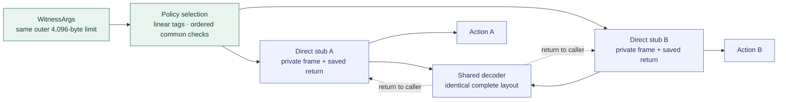

# 0.31 cost implementation

This is the development implementation of [D1–D6](CELLSCRIPT_0_31_COST_DECISIONS.md).
It is not a release announcement. Measurements below were collected on
2026-09-21 and rerun on 2026-09-22 from the `0.31` worktree based on
`c4a4ec1751a5ea15c6364f2f57744a8bfbafa7bd`.
Both the baseline and candidate reports declare dirty source. Signed commits,
clean-source gates, and independent boundary review remain acceptance work.
The workspace package version remains 0.30.0 until release preparation.

## What changed

- **D1 / #35:** cost-report v2 distinguishes transaction totals from selected
  Script-group scheduler cycles. A normal nonzero exit retains its measured
  cycles; setup failures, traps and exhausted limits remain unavailable.
  Static call-chain bounds include nested frames and temporary outgoing
  arguments. They are not observed stack peaks.
- **D2 / #31:** the assembler chooses a validated immediate plan once for
  instruction sizing and emission. Signed 12-bit decomposition and combined
  shifts replace long bytewise materialization when shorter. The old expansion
  remains the fallback. The fixed entry trampoline is unchanged.
- **D3 / #32:** compatible policy variants share a decoder. Each variant keeps
  its own direct decoder-to-action stub. The complete callable layout is the
  sharing key; uncertain layouts keep a dedicated adapter. Linear tag dispatch,
  the unknown-tag precheck, and common-check order remain in place.
- **D4 / #33:** fixed private adapters reserve their proven argument capacity.
  The outer loader still admits the same 4,096-byte WitnessArgs boundary,
  including optional fields and other records. Private copies and ownership
  remain explicit. Dynamic layouts and Script-argument consumers use the
  existing bounded fallback.
- **D5 / #34:** scalar stack addresses use one lookup. Eligible functions use
  deterministic CFG liveness and interference coloring, including joins,
  backedges, parameters, and calls. Resources, pointers, wide values, external
  calls and unclassified operations retain the old layout. Named mutable
  storage, buffers, helper scratch and outgoing arguments remain separate.
- **D6 / #30:** lowering record v9 binds the changed private-adapter and shared
  decoder machine patterns. Typed semantics v8, source-map v2, metadata schema
  72, source editions and witness formats retain their existing contracts.
  The independent checker verifies the new shapes and rejects unsupported
  record versions. No liveness claim is inferred from a reused offset alone.

## Measurements

The baseline uses the same expanded fixtures before D2–D5. Columns are
independent measurements, not a combined score. Policy cycle values are the
largest successful transaction and selected-group rejection values in the
named sweep. Static stack values describe a single VM call chain.

| Fixture | ELF bytes, before → after | Transaction success cycles | Group rejection cycles | Static stack bound, bytes |
| --- | ---: | ---: | ---: | ---: |
| 8 actions, 32-byte argument | 11,680 → 8,048 | 14,158 → 13,189 | 12,455 → 11,491 | 11,472 → 6,160 |
| 64 actions, 32-byte argument | 73,440 → 43,592 | 29,822 → 22,299 | 28,119 → 20,601 | 11,472 → 6,160 |
| 260 overlapping scalar values | 16,384 → 10,024 | 12,441 → 9,259 | See the per-execution report | 10,736 → 8,656 |

The retained Rust comparisons are also rerun with unchanged reference sources:

| Matched sample | CellScript / Rust ELF bytes | CellScript / Rust success cycles |
| --- | ---: | ---: |
| Pool merge | 2,312 / 2,816 | 5,924 / 9,232 |
| Schema roll | 2,272 / 2,760 | 8,661 / 10,350 |
| Ownership-claim Lock | 1,992 / 2,304 | 5,487 / 6,333 |

The main report contains three matched rows, eighteen retained growth rows,
forty-one expanded policy rows, nine scalar/call rows, and 1,830 execution
observations. A separate report covers six multi-Script cases, each with five
independently measured groups and four artifact stack bounds. Frozen ceilings
were recorded before optimization and are checked separately for each metric.
No exception to those ceilings was used for these results.

Both reports bind the same compiler source, dirty diff, untracked source files,
lockfile, toolchain and VM configuration. Their compilation profiles are
recorded separately: the matched corpus uses Edition 2027 at optimization level
3, while the existing multi-Script anchor keeps Edition 2026 at level 0.
The consumer rejects missing or mismatched source identities.

The address-lookup refactor was measured before enabling slot reuse: all
1,830 execution ELF hashes and all 71 cost rows matched the preceding candidate.
This isolates the mechanical refactor from the later liveness change. Changed
ELFs have new sidecars and transaction identities; old on-chain deployments
retain their old identities.

One iCKB negative transaction changes its first reported error from CellScript
exit 48 to xUDT exit -52. Both groups reject before and after the change. The
pinned CKB verifier orders Type groups by Script hash and returns the first
failure; the new ELF changes that ordering. The wrong-owner-hash fixture now
replays both groups independently and requires their original exit codes and
positive measured cycles. This is a transaction diagnostic change, not a claim
that every transaction's first error is identical after recompilation.

## Compatibility and remaining acceptance

Native CLI builds emit v9 records. The standalone checker, the CKB adapter,
the Registry verifier and the Registry artifact verifier consume the same
independent checker crate. Their builds and tests must move with this change.
The browser WASM API exposes metadata only, and the editor consumes metadata
and diagnostics; neither becomes an ELF-verification service. Fresh WASM and
editor packaging still belong to release validation.

The checkpoint reports are local evidence under
`target/cellscript-cost/baseline-before-optimizations/`; they are not clean
commit evidence or published release assets. The final backend and CI gates,
clean-source release replay, fresh downstream bundles, and a named independent
compiler/checker reviewer are required before release acceptance. The child
issues remain open until those conditions are recorded.

No dispatch tree, jump table, borrowed witness span, general register allocator,
or observed stack-peak instrument is included. The 0.32 deferrals in the
accepted decisions still apply.
