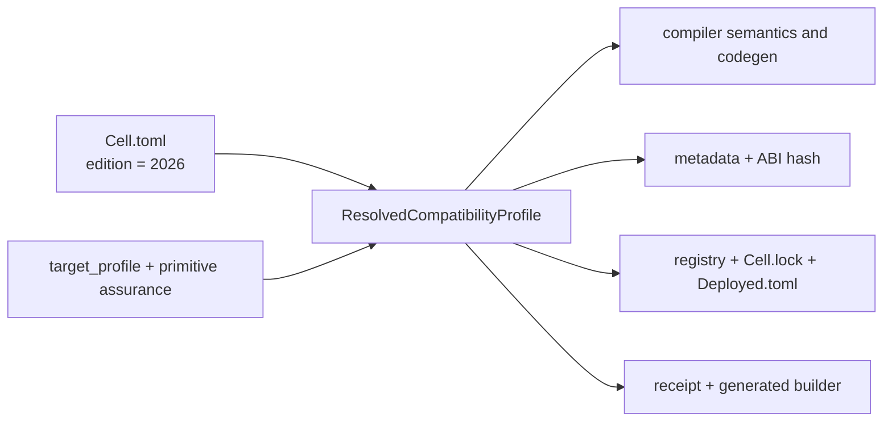

# CellScript Edition Policy

**Status**: normative for the 0.23 development line.

CellScript uses an edition as one explicit name for the complete language and
ABI contract selected by a package. It serves the same organizational purpose
as a Rust edition, but it also binds CellScript-specific CKB conventions.

The only supported edition is:

```toml
[package]
edition = "2026"
```

`edition` is mandatory in every package manifest. A missing value or any value
other than `2026` is an error. The 0.23 line does not provide an edition
migration command, an implicit alternate edition, or a compatibility parser
because Edition 2026 is the first CellScript edition contract.

## What The Edition Selects

Edition 2026 resolves one compatibility profile from:

- source-language semantics;
- target profile;
- primitive-assurance mode;
- entry payload ABI;
- CKB `WitnessArgs` placement ABI and script-group source.

For the CKB target, the resolved profile requires:

| Contract | Edition 2026 value |
|---|---|
| Payload ABI | `cellscript-entry-witness-v1` (`CSARGv1\0`) |
| Placement ABI | `cellscript-witnessargs-input-type-v2` |
| Placement field | `WitnessArgs.input_type` |
| Witness source | `GroupInput#0`, then `GroupOutput#0` |
| Raw payload alias | rejected |

The resolved profile is emitted in compile metadata and hashed into package,
registry, lockfile, deployment, receipt, and generated-builder identities.
Changing one of these choices therefore changes the identity even when source
text is otherwise identical.



## Why `CSARGv1` Still Exists

The edition and `CSARGv1` solve different problems.

- `edition = "2026"` tells the compiler and tooling which complete rule bundle
  to use before a transaction exists.
- `CSARGv1\0` identifies the bytes inside `WitnessArgs.input_type` while a CKB
  Script is executing.

Without the payload magic, arbitrary protocol bytes could be mistaken for
CellScript positional arguments. Without the edition, tools could agree on the
same eight magic bytes while disagreeing about placement, source selection, or
compile semantics. Edition 2026 selects the payload ABI; it does not remove the
payload's on-wire discriminator.

The old raw placement form—putting `CSARGv1` directly in the witness instead of
inside a canonical `WitnessArgs.input_type`—is not accepted. It fails closed
with runtime error `25 entry-witness-abi-invalid`.

## Persisted Format Boundary

Edition 2026 deliberately starts new persisted identities:

| Surface | Required identity |
|---|---|
| Compile metadata | metadata 56, source 2, artifact 1, constraints 2 |
| `Cell.lock` | version 2 |
| `Deployed.toml` | version 2 and `cellscript-deployed-v0.23-edition-2026` |
| Compile receipt | `cellscript-compile-receipt-v2` |
| Generated action builder | `cellscript-generated-action-builder-v0.23-edition-2026` |

Readers reject earlier versions. They do not silently fill edition/profile
fields or rewrite old files.

## API Boundary

Package compilation reads the mandatory edition from `Cell.toml`. APIs without
a package manifest must receive the edition explicitly:

- native metadata-only Rust APIs take `CellScriptEdition`;
- WASM exports take an edition string and accept only `"2026"`;
- browser workers pass `"2026"` explicitly;
- LSP package compilation resolves the nearest package manifest.

`CompileOptions::default()` uses the current edition only for in-memory and
standalone compiler use. It is not a fallback for a package missing
`edition`.

## Release Requirement

Changes to an edition-owned rule require matching updates to codegen, metadata,
identity hashes, builders, WASM, documentation, and tests. Because witness
placement affects generated RISC-V, such a change must pass the `backend` gate
as well as `dev` and `ci`.
