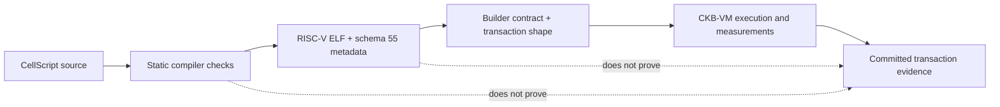

# CellScript 0.22 Release Notes

**Status**: Stable release notes for CellScript 0.22.0.

**Updated**: 2026-07-22.

CellScript 0.22 makes contract intent easier to express and easier to audit. It
adds typed transaction views, finite verification constructs, explicit
capability and flow evidence, clearer diagnostics, and a bounded Fiber asset
path. It also strengthens the release process so compiler evidence, builder
evidence, CKB-VM execution, and committed-chain evidence are no longer easy to
confuse.

CKB remains a Cell-model blockchain: transactions consume live Cells and create
new Cells, while Lock Scripts control spending and Type Scripts validate state
rules. A successful compile is therefore useful evidence, but it is not by
itself proof that a transaction can be built, accepted, or committed.

## At A Glance

| Area | What changes for you |
| --- | --- |
| Language | More verification logic is typed, finite, and explicit instead of encoded in strings or conventions. |
| Auditing | Every ProofPlan obligation has one of six evidence tiers, making the remaining owner of a proof visible. |
| CLI and LSP | `--json` is the canonical machine interface; diagnostics have stable codes and matching editor links. |
| CKB integration | New bounded CellDep, hashing, Merkle, and external BIP340-verifier helpers have explicit trust boundaries. |
| Examples | Bundled contracts model real Cell identities and asset settlement more faithfully. |
| Ecosystem | Fiber, Spore, and RGB++ paths are available within deliberately narrow, documented scopes. |
| Release safety | The full gate binds clean source, pinned CKB source and binary provenance, generated artifacts, public builder contracts, and stateful transaction evidence. |

## Install Or Upgrade

Install the published binary:

```bash
CELLSCRIPT_VERSION=0.22.0 curl -fsSL https://raw.githubusercontent.com/CellScript-Labs/CellScript/main/scripts/install.sh | sh
cellc --version
```

To build from source, use the repository-pinned Rust 1.97.1 toolchain and
initialize submodules recursively:

```bash
git clone --recurse-submodules https://github.com/CellScript-Labs/CellScript.git
cd CellScript
cargo install --locked --path .
```

Published binaries do not require a local Rust toolchain. Source builds and
workspace contributors do: all in-tree crates now use Rust Edition 2024 and
declare `rust-version = "1.97.1"`.

## How To Read 0.22 Evidence

The release makes the evidence hand-off explicit:



Every ProofPlan record now identifies exactly one evidence tier:

| Tier | Who or what must discharge it |
| --- | --- |
| `checked-static` | Compiler or static analysis. |
| `checked-runtime` | Generated verifier code. |
| `runtime-helper-required` | A known helper that the selected artifact has not emitted. |
| `builder-evidence-required` | Transaction builder or indexer. |
| `metadata-only` | Audit metadata with no executable enforcement. |
| `chain-evidence-required` | Dry-run, tx-pool, commit, capacity, or cycle evidence. |

`--production` rejects enforcement-like claims that remain metadata-only. It
does not silently promote builder or chain obligations into compiler proof.

## Typed Language And Verification Surface

The 0.22 line adds:

- checked casts and transitive callable-effect checking;
- enum-backed flows with one initial state, explicit terminal states, and
  checked terminal-by-output-state evidence;
- typed read-only transaction handles such as `InputView<T>`, `OutputView<T>`,
  `CellDepView`, `HeaderDepView`, and `WitnessArgsView`;
- finite `forall` and `count(...)` invariant quantification over closed source
  views;
- source-aware `BoundedCellSet<T, N>` and `BoundedList<T, N>` contracts with
  `consume_each` and `create_each`;
- a closed, versioned capability algebra with explicit entailment records;
- concrete fixed-width payload enums, exhaustive matching, and a bounded
  register-pair return ABI;
- canonical type `validity` blocks;
- compile-time-only `borrow root as view { ... }` regions; and
- deterministic participant-role candidates in ProtocolGraph metadata.

The compiler continues to fail closed on dynamic or recursive payload ADTs,
generic payload enums, unbounded resource iteration, authority borrowed from a
container, escaping borrow views, and unsupported validity environments.

`env::block_number()` is intentionally builder evidence rather than a fictional
ambient CKB-VM syscall. Transaction-view reads inside validity predicates remain
unsupported.

## Metadata Schema 55

Current artifacts emit compile metadata schema 55. It carries callable and flow
evidence, transaction-view handles, bounded collections, capability proofs,
enum layouts, protocol-role candidates, validity predicates, borrow regions,
and the bounded Fiber compatibility record.

Metadata consumers must compare the emitted version and reject unsupported
versions. Recompile old artifacts and regenerate receipts or audit bundles
instead of copying schema-44-era assumptions into a 0.22 workflow.

## CLI, Diagnostics, And Editor Experience

`--json` is now the single public machine-output switch. Success and failure
emit exactly one JSON document on stdout. The hidden
`--message-format=json` spelling remains temporarily available for compatibility.

Backend diagnostics use stable `E2xxx` codes. JSON diagnostics contain the code,
name, description, and recovery hint; `cellc explain E2202 --json` exposes the
same registry. LSP diagnostics carry the standard `code` field and a
`codeDescription` link. VM and simulator `cellc run --json` output now shares
one schema, using `null` when cycles or steps are unavailable.

The VS Code extension is released from the `editors/vscode-cellscript`
submodule. Version 0.22 adds grammar, snippets, hover, completion, and validation
coverage for the new syntax while continuing to delegate semantic decisions to
`cellc`. `cellscript-mcp` remains a read-only compiler/documentation interface,
not a second compiler or deployment client.

The website's provenance and assurance snapshots are regenerated from the
0.22 compiler output; they no longer show stale 0.17 compiler or metadata
versions.

## Bundled Contract Hardening

The examples now model assets as Cells rather than treating identifiers or
witness values as settlement:

- AMM pools bind both token TypeHashes and derive initial LP supply
  geometrically;
- NFT sales consume and relock typed Token payments;
- timelocks and atomic swaps release actual Token outputs;
- DAO votes lock and redeem voting Tokens;
- vesting declares an `Active -> Active` self-loop for repeatable partial
  claims, while keeping `Active -> FullyClaimed` as the terminal transition;
  and
- resource permutations that preserve typed fields are checked as runtime
  conservation without action-name-specific backend rules.

The bundled multisig example now says what it actually proves. Its `Approval`
records are non-cryptographic approvals; signer authentication, sighash and
WitnessArgs binding, replay policy, and real signature verification belong in a
Lock Script or pinned verifier package.

The production example matrix contains 43 business actions and 17 locks. Pure
AMM helpers are no longer exposed as transaction entries.

## CKB Crypto And CellDep Helpers

New runtime helpers include:

- exact-index and literal-bounded resolved CellDep data-hash checks;
- fixed-width SHA-256 and SHA256d for 32-byte values and 64-byte pairs; and
- SHA256d Merkle verification with a literal depth in `0..=16`.

The bounded CellDep scan accepts only a literal maximum in `1..=64`, uses the
real resolved-CellDep data-hash syscall path, and fails with a stable runtime
error when no match is found. CKB-VM sees resolved CellDeps; out points, dep
types, and original DepGroup identity remain builder or manifest evidence.

`verifier::btc::bip340::require_signature_from_cell_dep` selects a literal
CellDep index and uses a fixed 144-byte VM2 IPC envelope. It verifies only the
supplied prehash. The calling package still owns message-domain construction,
ScriptGroup/WitnessArgs and sighash selection, key authority, replay policy,
deployment pinning, and external verifier review. See the
[signature verifier ABI](../CELLSCRIPT_SIGNATURE_VERIFIER_ABI.md).

## Fiber, Spore, And RGB++ Boundaries

The new `cellscript-fiber-adapter` crate derives a dedicated
`fungible-type-group-v1` artifact and native Fiber UDT configuration from
compiler, deployment, live-Cell, and node evidence. The executable boundary is
narrow: exact 16-byte little-endian `u128` data, full Type Script group
conservation, and closed issuance/destruction authority formats.

Bounded local-devnet runs covered Fiber's official multi-hop UDT payment and
pending-TLC watchtower force-close collections. The clean pinned full
lifecycle/negative matrix is still pending, so this is not a production-ready
or general Fiber compatibility claim. See the
[Fiber operator guide](../../examples/fiber/README.md).

The compile-checked Spore and RGB++ identity-adapter examples bind exact Script
identities and transaction positions. They do not reimplement protocol rules,
Bitcoin SPV, confirmation/reorg policy, witnesses, or SDK transaction
construction. See the
[interop boundary guide](../wiki/Spore-and-RGBPP-Interop-Boundaries.md).

## Release Gate Hardening

The full release workflow now runs the authoritative release gate before any
binary build or GitHub publication. Release evidence requires:

- a completely clean CellScript tree and, for publication, an exact
  version-matched tag;
- the pinned clean CKB revision from `scripts/ckb_acceptance_pin.json`;
- a freshly built CKB executable from that source in a dedicated Cargo target,
  archived and hashed with the evidence report;
- source template, effective configuration, genesis, executable, and artifact
  provenance;
- all 43 stateful action paths plus all 17 valid/invalid lock-spend paths, with
  commit, input-liveness, output-liveness, cycles, serialized size, and occupied
  capacity checks;
- exact 20-byte ELF entry-trampoline verification;
- a path-normalized, symbol-stripped NovaSeal RISC-V verifier ELF whose pinned
  bytes reproduce across the audited macOS arm64 and Linux amd64 builders;
- fresh WASM packaging with an explicit Binaryen `wasm-opt -Oz` pass and the
  600 KB gzip budget enforced (the audited 0.22 bundle is about 549 KB gzip),
  plus fresh VS Code packaging; and
- tests and clippy for every workspace package.

The gate labels transaction origins honestly. The on-chain transaction matrix
is a handwritten Python acceptance harness. Separately, every production action
must pass the public `cellc action build` and `cellc gen-builder` contract gate.
The local resource Type Scripts are `always_success` fixtures, so this evidence
proves scoped verifier behaviour and transaction shape, not a production
passive-resource-identity deployment.

## Migration Checklist

Before moving a 0.21 workflow to 0.22:

1. Pin or install CellScript 0.22.0 and confirm `cellc --version`.
2. Use `--json` for automation and require exactly one stdout document.
3. Update metadata consumers to schema 55 and fail closed on unknown versions.
4. Recompile ELF artifacts and regenerate metadata, receipts, builders, and
   audit bundles.
5. If building from source, use Rust 1.97.1 and initialize submodules
   recursively.
6. Re-run the gate matching the claim you intend to make; compiler success does
   not replace builder or chain evidence.

## Deliberate Boundaries

CellScript 0.22 does not claim:

- production Fiber readiness without the pinned external lifecycle matrix;
- builder, capacity, tx-pool, commit, or live-chain evidence from compiler-only
  ProofPlan tiers;
- dynamic, recursive, or generic payload ADTs;
- unbounded collection iteration;
- transaction-view reads inside type validity predicates;
- consensus-checked TemplateLayout commitments;
- canonical AST/IR receipt hashes; or
- production Spore, RGB++, Bitcoin SPV, or external BIP340-verifier assurance
  without their pinned packages and independent evidence.

## Validation Commands

Routine local work:

```bash
./scripts/cellscript_gate.sh dev
```

Merge readiness:

```bash
./scripts/cellscript_gate.sh ci
```

IR, codegen, assembler, ABI, ELF, or RISC-V changes:

```bash
./scripts/cellscript_gate.sh backend
```

Release-facing CKB evidence:

```bash
./scripts/cellscript_gate.sh release
```

`release-quick` is a compile-only preflight. It is not external live/devnet
evidence.

For the exact trust and evidence boundaries, read the
[gate policy](../CELLSCRIPT_GATE_POLICY.md) and
[metadata verification tutorial](../wiki/Tutorial-06-Metadata-Verification-and-Production-Gates.md).
