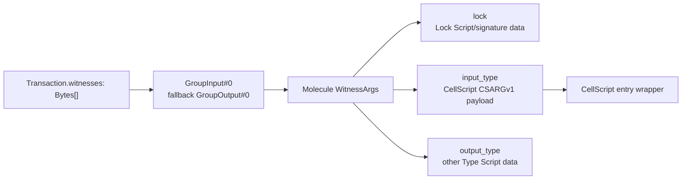

# CellScript 0.23 Release Notes

**Status**: Development release notes for `nightly-0.23`; not a stable release
certificate.

**Updated**: 2026-07-31.

CellScript 0.23 makes its language and CKB entry ABI one explicit contract.
Edition 2026 is the first and only CellScript edition, and CellScript entry
arguments now have one canonical location:
`WitnessArgs.input_type` on the selected script-group witness.

This document records completed 0.23 work. Registry deployment, broader
RGB++/Fiber evidence, and the Off-Chain Session Runtime profile remain roadmap
work until their implementation and evidence boundaries are complete.

## At A Glance

| Area | What changes |
| --- | --- |
| Edition | Every package declares `edition = "2026"`; no other edition, inference, or migration path is accepted. |
| Entry witness | `CSARGv1` is decoded only from canonical Molecule `WitnessArgs.input_type`. |
| Failure mode | Raw payloads, malformed tables, absent `input_type`, wrong placement, and mismatched identities fail closed. |
| Build identity | The resolved compatibility profile is bound into metadata, registry, lock, deployment, receipt, and builder records. |
| Registry contract | Publish protocol v2 and registry schema 2 require Edition 2026 plus its compatibility-profile hash from CLI signature through API, database, CDN JSON, and website. |
| Tooling | CLI, LSP, WASM, website bindings, examples, and package tooling use the same edition contract. |
| Native gate | Active test, fixture, evidence, and release tooling is Rust, shell, or Node; repository policy rejects Python source reintroduction. |

## Edition 2026

`Cell.toml` now requires:

```toml
[package]
edition = "2026"
```

Edition 2026 selects the complete CellScript compatibility contract rather
than acting as a parser-only label. It resolves:

- source-language semantics;
- target-profile behavior;
- primitive-assurance mode;
- entry-payload encoding; and
- CKB witness placement and script-group source.

The resolved profile is emitted in compile metadata. Its hash is required by
registry build records, `Cell.lock` version 2, `Deployed.toml` version 2,
compile receipts, and generated action builders. Verification rejects a
missing or mismatched profile instead of guessing.

There is intentionally no compatibility or migration layer. Edition 2026 is
the first CellScript edition contract, and there is no published package
ecosystem that requires another interpretation.

## Canonical WitnessArgs Entry ABI

CKB transaction witnesses remain raw byte arrays at the transaction layer.
CellScript now requires the selected bytes to encode the standard Molecule
`WitnessArgs` table:

```text
WitnessArgs {
    lock:        BytesOpt,
    input_type:  BytesOpt,  // CellScript CSARGv1 entry payload
    output_type: BytesOpt,
}
```

The generated entry wrapper loads `GroupInput#0`. If the active script group
has no input, it loads `GroupOutput#0`. It validates the `WitnessArgs` table and
its `BytesOpt` offsets, extracts `input_type`, checks the `CSARGv1\0` magic, and
only then decodes positional arguments.



Edition 2026 does not accept `CSARGv1` as a raw witness alias. A raw payload,
malformed Molecule table, missing `input_type`, or payload in `lock` or
`output_type` fails with runtime error
`25 entry-witness-abi-invalid`.

Generated builders parse or create `WitnessArgs`, preserve `lock` and
`output_type`, and refuse to overwrite an occupied `input_type`. This keeps
CellScript arguments separate from Lock Script signatures and from another
Type Script's output-side data while remaining compatible with CKB's shared
witness convention.

## Persisted Format Boundary

The 0.23 identity set is:

| Surface | Required identity |
| --- | --- |
| Compile metadata | metadata 56, source 2, artifact 1, constraints 2 |
| `Cell.lock` | version 2 |
| `Deployed.toml` | version 2 and `cellscript-deployed-v0.23-edition-2026` |
| Compile receipt | edition and resolved compatibility profile |
| Generated action builder | `cellscript-generated-action-builder-v0.23-edition-2026` |
| Registry build record | edition and compatibility-profile hash |
| `registry.json` / public publish | schema 2 / `cellscript-registry-publish-v2` |

Consumers reject other identities. Rebuild the artifact and regenerate its
metadata, lock/deployment records, receipt, and builder together.

The registry boundary has no v1 reader or migration path. The write API checks
the complete signed nested entry instead of accepting an untyped JSON object,
persists edition/profile as typed columns, and repeats them in the CDN object.
Generic admin status changes may quarantine, yank, deprecate, or move an entry
through indexing, but cannot label it `verified_build` or `deployed` without a
future evidence-specific promotion endpoint.

## CLI, LSP, WASM, And Website

- Package commands read Edition 2026 from `Cell.toml`.
- LSP modules carry the edition through the same compiler path used by `cellc`.
- WASM metadata exports require an explicit edition argument and currently
  accept only `"2026"`.
- The playground worker and TypeScript declarations pass that edition into the
  WASM boundary and include it in compiler-output provenance.
- Registry pages reject stale schema-1 fixture data and display each package
  version's edition and compatibility-profile hash.
- Entry-witness reports, ABI reports, action plans, and generated builders
  expose canonical `WitnessArgs.input_type` placement.
- NovaSeal core, agreement, and planned-profile devnet transaction constructors
  serialize their `CSARGv1` payloads as Molecule `WitnessArgs.input_type`
  instead of emitting the retired raw form.

## Native Tooling Closure

The 0.23 line also completes the removal of Python from active project tooling.
`cellscript-tools` owns gate, evidence, fixture, NovaSeal, Evolving-DOB, and CKB
acceptance logic; website data generation remains in tracked Node modules.
Every gate runs the native source-policy check, which rejects Python sources,
generated interpreter caches, and interpreter references in active tooling
source across the repository and initialized submodules.

Native fixture generation can read live reports from an explicit isolated
evidence root. Its integration tests therefore pass from a clean checkout and
cannot inherit stale `target/` reports from a developer machine.

This changes the tooling implementation, not the meaning of production
evidence. iCKB equivalence, NovaSeal pinning, stateful CKB scenarios, and
website/WASM checks retain their separate evidence boundaries.

## Deliberate Boundaries

CellScript 0.23 does not claim:

- that witness bytes are authority without explicit signature and key binding;
- that `input_type` is the input Cell's Type Script;
- that compiler success proves transaction construction, capacity, dry-run,
  tx-pool, commitment, or liveness;
- that `CSARGv1` replaces Molecule or CKB `WitnessArgs`; or
- stable-release readiness from `dev` or `ci` alone.

## Validation Commands

Routine local validation:

```bash
./scripts/cellscript_gate.sh dev
```

Merge-readiness validation:

```bash
./scripts/cellscript_gate.sh ci
```

ABI and generated RISC-V validation:

```bash
./scripts/cellscript_gate.sh backend
```

Production release evidence:

```bash
./scripts/cellscript_gate.sh release
```

The `backend` stateful portion and both release modes require a clean tree and
their documented external dependencies. A passing lighter gate must not be
reported as release evidence.

## Detailed Documentation

- [CellScript Edition Policy](../CELLSCRIPT_EDITION_POLICY.md)
- [Entry Witness ABI](../CELLSCRIPT_ENTRY_WITNESS_ABI.md)
- [Package provenance and deployment identity](../CELLSCRIPT_PACKAGE_PROVENANCE_AND_DEPLOYMENT_IDENTITY.md)
- [CKB target profiles](../wiki/Tutorial-05-CKB-Target-Profiles.md)
- [Metadata verification and production gates](../wiki/Tutorial-06-Metadata-Verification-and-Production-Gates.md)
- [0.23 roadmap](../../roadmap/CELLSCRIPT_0_23_ROADMAP.md)
- [Changelog](../../CHANGELOG.md)
