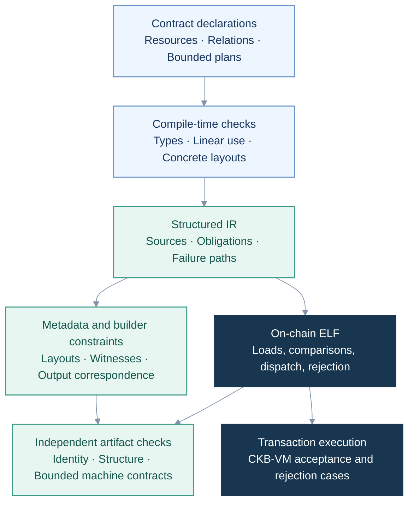
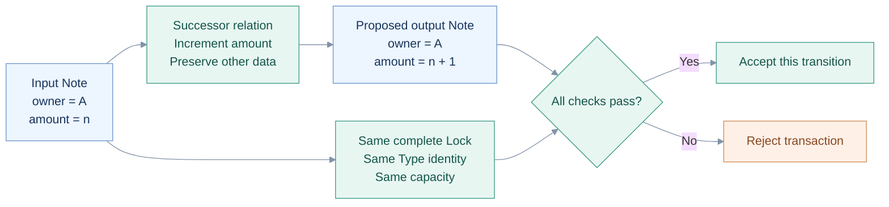
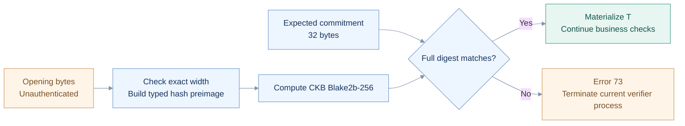
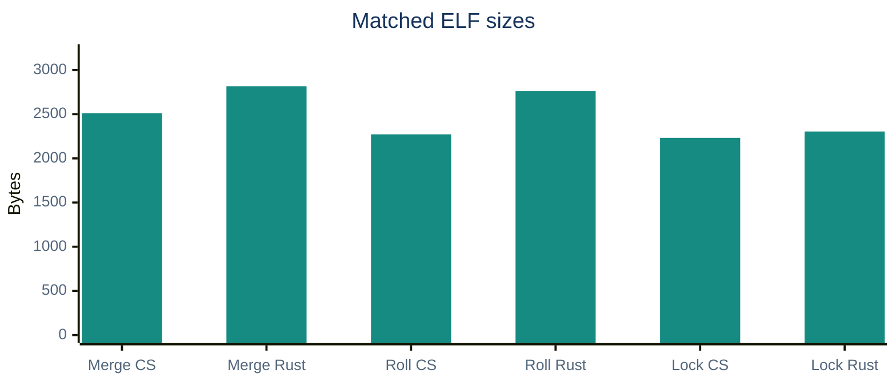
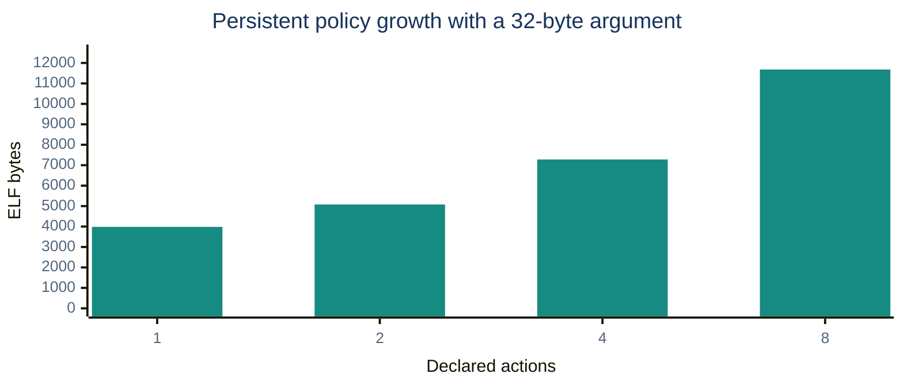
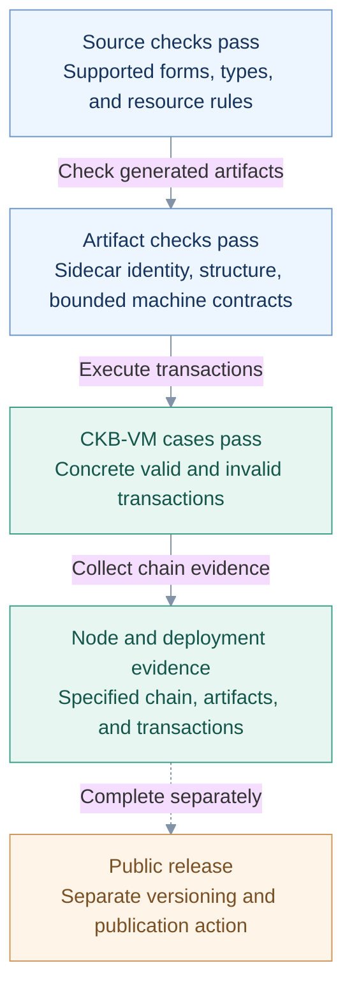

# CellScript 0.30: Abstractions, Bytes, and the Cost of an Alternative

> Based on branch `0.30`, commit `6d75a6e7`. The matched cost tests and growth measurements were rerun on September 21, 2026. Version 0.30.0 is for now a release candidate; 0.25 remains the previous stable release.

I deliberately put off the byte and execution costs of CellScript's abstractions until 0.30. Earlier work concentrated on resource lifecycles, successor relations, bounded inputs and outputs, and transactions involving several Scripts. I wanted those abstractions to have a concrete executable meaning first. Cost optimisation came later because I chose that order.

That decision now needs a bit of accounting. I kind of expect CellScript to develop a parallel sub-ecosystem within CKB, offering an alternative to writing contracts directly in Rust. Contract templates, resource libraries, transaction builders, interface conventions, and review tools will very likely accumulate around it. New projects will also likely reuse those components and inherit their assumptions. So they will also inherit whatever overhead the compiler leaves in the generated code.

This makes cost optimisation consequential beyond an individual benchmark. A recurring byte or cycle penalty can spread through every project that uses the same abstraction. An improvement to a common compilation path can reach those projects as well. Before more code is built on CellScript, I need to know what its convenience costs against a reasonably tight Rust implementation.

The current measurements are encouraging, with a qualification that matters. In three matched samples, the CellScript executable is **3.1%–17.7% smaller**, and successful execution uses **11.8%–35.0% fewer cycles** than the Rust reference. More elaborate abstractions carry visible costs. A persistent Type policy with a 32-byte argument grows from **3,984 bytes** at one action to **11,680 bytes** at eight actions. Both results belong in this report.

The work described here also includes the unpublished 0.26 and 0.26b changes incorporated into 0.30. Linear resources, generics, and metadata existed earlier. This release adds executable coverage, tighter code generation, and enforced cost measurements to that foundation.

[Release scope](https://github.com/CellScript-Labs/CellScript/blob/6d75a6e7e4ce55b940697428d895eda74a51ca86/docs/releases/CELLSCRIPT_0_30_RELEASE_NOTES.md)

## 1. What the language takes responsibility for

I'll start with the CKB model, because it's easy to read too much into a word like `create`. A transaction consumes existing Cells and creates new ones. Scripts check the inputs and outputs the transaction has already supplied. Locks control spending, and Type Scripts constrain state changes. CellScript's `create` and `replace` generate checks on those proposed outputs; they don't allocate an object on-chain while the Script runs. [CKB Script documentation](https://docs.nervos.org/docs/script/intro-to-script)

In a Rust contract, that usually means selecting a source and index, loading bytes, checking their length, decoding fields, finding the corresponding output, and comparing data, Script identities, and capacity. You can organise this quite well with libraries and custom types. Someone still has to specify what each value represents in the transaction and make sure the required checks are there.

What I want from CellScript is to keep more of that meaning in the declaration. If an input represents a resource that must be consumed, or an output must continue a particular input, the compiler should retain that information all the way through lowering. The builder can then use the same layout and transaction constraints, and the independent artifact checker can examine the parts of the generated bundle for which it has a checking contract.



I still need to be able to inspect what the compiler did. Metadata tells me what it claims to have generated. The machine checks test the supported parts of that claim, and transaction tests show what happens with concrete inputs. None of those files is particularly interesting on its own; the useful part is being able to follow a source-level requirement into the code that checks it.

## 2. Writing the successor relation explicitly

Take a fairly ordinary update: increment an amount and keep everything else. It's easy to remember the owner and overlook capacity or the complete Lock identity. If those checks are scattered through a function, I have to reconstruct the intended transition while reviewing it.

This is how the relation can be written in Edition 2027. The example comes from `authoring_replace`, with the module declaration omitted. You do have to opt into Edition 2027 for this syntax.

```cellscript
resource Note has store, replace, relock {
    owner: Address,
    amount: u64,
}

action roll(input note: Note) -> next: Note {
    replace note -> next {
        data = same except { amount = note.amount + 1 }
        lock = same
        capacity = same
        identity = same
    }
}
```

Here, `amount` goes up by one. The other data, complete Lock Script hash, Type identity, and capacity all stay the same. The compiler checks the declaration against the resolved schema and expands it through the AST and IR.



For me, the main benefit is that I can read the preservation rules in one place. It also gives schema changes something concrete to check against: a new field may need an explicit treatment or acknowledgement. The linear resource rules catch a different set of mistakes, including copying a resource, using it after consumption, or leaving it unhandled on a successful branch.

The Rust reference loads 40 bytes, compares the first 32 as the owner, decodes the last eight as the amount, does a checked addition, then separately loads and compares LockHash, TypeHash, and Capacity. There's nothing unreasonable about that code. I'd just rather have the compiler generate this recurring set of checks from a relation I can review directly. Choosing the right relation is still the contract author's job. [Relation tests](https://github.com/CellScript-Labs/CellScript/blob/6d75a6e7e4ce55b940697428d895eda74a51ca86/tests/authoring_replace.rs), [Rust reference](https://github.com/CellScript-Labs/CellScript/blob/6d75a6e7e4ce55b940697428d895eda74a51ca86/tests/fixtures/cost_corpus/src/schema_roll.rs), [linear ownership rules](https://github.com/CellScript-Labs/CellScript/blob/6d75a6e7e4ce55b940697428d895eda74a51ca86/docs/CELLSCRIPT_LINEAR_OWNERSHIP.md)

Edition 2026 is still the default. One part of the 0.30 compatibility work was restoring the 0.25 rules for its generic declarations. The stricter public layout requirements apply to declarations owned by Edition 2027 modules. I don't want a clearer way of writing new contracts to quietly change the meaning of old ones. [Compatibility audit](https://github.com/CellScript-Labs/CellScript/blob/6d75a6e7e4ce55b940697428d895eda74a51ca86/docs/CELLSCRIPT_0_25_0_30_SYNTAX_AUDIT.md)

## 3. Batches have an executable contract

Batches took more care. Before a collection is useful in a verifier, I need to know where its elements come from, which order they use, how many there can be, and what an extra element does to the result. At the moment, two bounded forms have an executable contract.

| Form | Executable meaning | Limits |
|---|---|---|
| `BoundedCellSet<T, N>` with `consume_each` | Scan the current Type Script's GroupInput in order and discharge each selected linear resource | `1 ≤ N ≤ 1024`; fixed element width of 1–512 bytes; supported pure predicates and accumulator updates |
| Witness `BoundedList<Plan, N>` with `create_each` | Match each witness plan element to its GroupOutput | Fixed layouts; one complete create template; explicit Lock and capacity floor; exact count, order, and field correspondence |

Group membership comes from the complete current Type Script. The scan rejects a successfully loaded element at index `N`, which would establish an `N + 1`st member. Only the specified index-out-of-bound result terminates the scan normally.

For outputs, plan element `i` corresponds to GroupOutput `i`. The verifier checks data, Lock, Type, and capacity, then probes the next group output to rule out an unchecked extra Cell. Identical plan values are allowed at different positions; they describe distinct outputs.

Those restrictions are fairly deliberate. Arbitrary sources, dynamic element layouts, and unrestricted loop effects would each need more rules and more runtime checks. A `Vec<Token>` still isn't a general container of owned Cells in this version.

The byte budget also turns up sooner than the type parameter might suggest. A plan with a 32-byte owner and an eight-byte amount takes 40 bytes. Add the 12-byte header and apply `12 + N × 40 ≤ 4084`, and this particular layout fits **101 elements**. The general bound of 1024 doesn't mean every layout can fit that many elements in a witness. [Input contract](https://github.com/CellScript-Labs/CellScript/blob/6d75a6e7e4ce55b940697428d895eda74a51ca86/docs/CELLSCRIPT_BOUNDED_GROUP_INPUT_CONTRACT.md), [output contract](https://github.com/CellScript-Labs/CellScript/blob/6d75a6e7e4ce55b940697428d895eda74a51ca86/docs/CELLSCRIPT_BOUNDED_OUTPUT_PLAN_CONTRACT.md)

## 4. Policies, composition, and authenticated values

### Several actions under one persistent Type policy

A persistent Type policy lets several actions use the same Script, with a versioned witness selecting the action. That gives transfers, merges, and destruction a way to share one policy implementation and Type identity.

There's quite a bit of checking behind that convenience. The dispatcher has to match the complete Script, recognise the tag, forward the right arguments, and run common checks in order. Unknown tags, records for another Script, and malformed envelopes must fail. The independent checker now covers this bounded selector and adapter path. It still takes transaction tests to check what an action actually does. [Policy witness ABI](https://github.com/CellScript-Labs/CellScript/blob/6d75a6e7e4ce55b940697428d895eda74a51ca86/docs/CELLSCRIPT_POLICY_WITNESS_ABI.md)

### Several Scripts describing one transaction

With several Scripts in one transaction, I also need to catch disagreements between them. ProtocolBundle does that work off-chain, using independently compiled artifacts. It records physical input and output roles, witness field ownership, CellDeps, HeaderDeps, and deployment identities. If two artifacts both claim an input exclusively, or expect incompatible contents in the same witness field, the bundle can reject the combination before constructing the transaction.

The ELF files remain separate, and signing still happens separately. The check I care about in the four-artifact fixture is quite literal: the adapter must produce exactly the same Molecule transaction bytes as the executable test. Otherwise, a successful test and a successful builder could still be talking about different transactions. [ProtocolBundle](https://github.com/CellScript-Labs/CellScript/blob/6d75a6e7e4ce55b940697428d895eda74a51ca86/docs/CELLSCRIPT_PROTOCOL_BUNDLE.md), [business corpus](https://github.com/CellScript-Labs/CellScript/blob/6d75a6e7e4ce55b940697428d895eda74a51ca86/docs/CELLSCRIPT_0_30_BUSINESS_CORPUS.md)

### Keeping identities and unauthenticated bytes distinct

`ScriptHash` represents a complete Script hash. An `Address` cannot silently stand in for it. An explicit conversion from a raw hash assigns a type domain; it establishes neither deployment nor authority. ExactScriptHandle binds additional artifact, interface, runtime ABI, and deployment records. Generic handles selected through open interface compatibility remain outside this release.

For `Commitment<T>` and `Opening<T>`, the question is when I'm allowed to treat witness bytes as an authenticated value. The verifier has to check the commitment before materialising `T`. An opening can be consumed once; it can't be inspected beforehand, copied, or stored.



The canonical type name, packed width, and exact value bytes enter the hash preimage. The preimage and comparison digest must fit the 512-byte scratch region. Dynamic layouts, recursive values, and zero-knowledge proof objects are outside this profile. [Committed substate contract](https://github.com/CellScript-Labs/CellScript/blob/6d75a6e7e4ce55b940697428d895eda74a51ca86/docs/CELLSCRIPT_COMMITTED_SUBSTATE.md)

Public value generics use concrete layouts too. Templates are specialised before IR, and phantom parameters affect type identity without taking up serialized bytes. Specialisation can of course add code. I'd want a separate growth test for the number of concrete instantiations; the 18 measurements below don't cover that yet. [Public value generics](https://github.com/CellScript-Labs/CellScript/blob/6d75a6e7e4ce55b940697428d895eda74a51ca86/docs/CELLSCRIPT_PUBLIC_VALUE_GENERICS.md)

## 5. Where the bytes went

### ELF layout and immediate encoding

The first size problem was rather mundane. One transfer-relation artifact was 7,824 bytes, but its payload only began at file offset 4,096. Padding before the code occupied 50.82% of the whole file.

Moving the payload start to offset 128, while preserving the LOAD segment's required address and offset alignment, removed **3,968 bytes**. Selecting a single ADDI or LUI for suitable `li` values removed another **464 bytes** in that sample.


That removed **4,432 bytes, or 56.65%**, from this artifact. The 3,856-byte middle step is calculated from the two recorded changes; the starting and ending sizes come from the historical audit. I'm keeping that history separate from the current matched samples below, which use different fixtures. [Layout and encoding measurements](https://github.com/CellScript-Labs/CellScript/blob/6d75a6e7e4ce55b940697428d895eda74a51ca86/docs/releases/CELLSCRIPT_0_26_RELEASE_NOTES.md#compact-elf-layout-save-3968-bytes-before-the-first-instruction)

### Repeated work in generated code

Removing the padding wasn't enough. The compact Rust references were still smaller in all three small samples, so the next work had to deal with repeated operations in the generated code.

| Layer | Change | Required condition |
|---|---|---|
| IR | Fold recognised exact byte comparison, copy, and zeroing loops | Structured operands and complete bounds must be established; no business inference from function names |
| Schema | Reuse dominating exact-size checks and aligned u64 loads | Unknown alignment or invalidated size facts retain the checked path |
| Calls and local instructions | Remove immediate stack reloads and fuse comparisons used only by branches | Stay within call, label, branch, and mutable-memory boundaries |
| Runtime | Share copy, compare, and zero helpers; reuse exact-read windows | Bind caches to the complete source and byte kind; recheck requested ranges |
| Source decoding and hashing | Decode SourceView halves with shifts; improve hash register use and rotate instructions | Reject invalid sources and stay within the admitted target instruction contract |

One tradeoff here is the larger register read window. It only gets enabled when there are enough exact reads to repay the setup cost. Saving and restoring more registers would otherwise charge a small contract for an optimisation it barely uses.

The VM2 requirements belong to the target profile and deployment contract. The relevant new artifacts use Data2. Existing Data1 deployments retain their original meaning; updated sidecars cannot give an old deployment new VM behavior. [Backend changes and deployment contract](https://github.com/CellScript-Labs/CellScript/blob/6d75a6e7e4ce55b940697428d895eda74a51ca86/docs/releases/CELLSCRIPT_0_26_RELEASE_NOTES.md#economic-backend-closure-and-vm2-deployment-contract)

## 6. The raw Rust comparison

For the comparison, I use direct Rust CKB Scripts built with `no_std`, `ckb-std 1.1.0`, `opt-level = z`, thin LTO, one codegen unit, and aborting panics. Symbols are removed with the selected toolchain's `llvm-strip`. I wanted a reasonably tight reference that someone might actually choose when size matters.

The CellScript side uses Edition 2027, optimisation level 3, target `riscv64-elf`, and profile `ckb`. Each pair runs in the same fixture context for its sample, with the listed acceptance and rejection cases checked on both sides. For size, I'm comparing CellScript executable bytes without the VM ABI trailer against the stripped Rust file. Metadata, lowering records, and source maps aren't counted in that figure.

### Measurements rerun for this report

| Sample | CellScript ELF | Rust ELF | Fewer bytes | CellScript cycles | Rust cycles | Fewer cycles |
|---|---:|---:|---:|---:|---:|---:|
| Two-input pool merge | 2,512 B | 2,816 B | 10.8% | 6,000 | 9,232 | 35.0% |
| Two-field schema roll | 2,272 B | 2,760 B | 17.7% | 8,661 | 10,350 | 16.3% |
| Owner-claim Lock | 2,232 B | 2,304 B | 3.1% | 5,583 | 6,333 | 11.8% |

The percentages use `(Rust − CellScript) / Rust`, rounded to one decimal place. Cycles come from successful executions. The shared harness returns transaction Script-verification cycles, including the other Scripts in that fixture; these are not isolated instruction counts for the principal Script. Each row has its own test context, so the useful comparison is between the two implementations within that row. The test writes the measurements to JSON, and I've included the complete growth table at the end of this report. [Cost test and report writer](https://github.com/CellScript-Labs/CellScript/blob/6d75a6e7e4ce55b940697428d895eda74a51ca86/tests/cost_corpus.rs)



**Pool merge** requires two positive input amounts, a checked sum, an output amount equal to that sum, and an output Lock hash matching the witness recipient. The fixture does not implement a complete issuance or capacity policy.

**Schema roll** preserves the owner, increments the amount by one, and preserves Lock, Type, and capacity. It's the small successor relation discussed earlier.

**Owner-claim Lock** needs a little explanation because the filename is `nft_lock`. This sample only compares an owner value in the input with a claim in the witness. It doesn't verify a signature, and anyone who knows the owner bytes can supply them. I'm using it to measure parameter loading and equality. The signed NFT lifecycle is covered elsewhere; this number says nothing about the cost of authenticating an owner.

There's another difference worth keeping visible: the Rust helper scans WitnessArgs fields for the entry payload, while the current CellScript ABI requires it in `input_type`. Both implementations produce the expected results on the recorded fixtures. I haven't established that they accept exactly the same set of malformed or otherwise untested envelopes.

I'm comfortable saying that these three CellScript samples are smaller and use fewer successful-execution cycles than their current Rust references. I wouldn't extend that to every Rust implementation or every contract. Another workload can still turn up a counterexample.

### Historical results for larger contracts

There are also earlier Spore and Fiber comparisons in the repository. I haven't rerun them for this report, but they give some context beyond the small fixtures.

| Historical workload | CellScript / Rust ELF | CellScript / Rust cycles | Measurement scope |
|---|---:|---:|---|
| Spore | 53,000 / 66,840 B | 2,976,826 / 3,163,715 | Sum over 11 accepted transactions; ELF sizes exclude the identical shared Agent |
| Fiber commitment | 63,336 / 69,176 B | 591,187,239 / 597,093,558 | Transaction-level sum over the 256-path sample, including an external signature verifier |

I have to be more careful with the Fiber cycles. Changing the principal ELF changes the transaction hash and signature, and the external signature verifier can vary by more than the small differences in individual rows. That's why the record reports the transaction aggregate. I can't attribute that whole difference to the principal Script. [Historical measurements and scope](https://github.com/CellScript-Labs/CellScript/blob/6d75a6e7e4ce55b940697428d895eda74a51ca86/docs/releases/CELLSCRIPT_0_26_RELEASE_NOTES.md#matched-measurements-after-closure)

## 7. What happens as the abstraction grows

The three matched samples leave an obvious question: what happens when people use more of the abstraction? The growth corpus currently has **18 rows**. There are three single-action controls with 8-, 32-, and 128-byte arguments, twelve policies combining those widths with 1, 2, 4, or 8 actions, and three input groups bounded at 1, 4, or 16 Cells.

Every policy action runs with a valid payload and a rejected last-byte mutation. Group cases run at the bound, reject one extra Cell, and reject an invalid final element. Generated growth artifacts also pass independent artifact validation. These rejection checks establish the result, not its execution cost: the current harness records zero cycles on an error because that measurement is unavailable. I need to fix that accounting before adding rejection-cycle budgets. [Execution harness](https://github.com/CellScript-Labs/CellScript/blob/6d75a6e7e4ce55b940697428d895eda74a51ca86/tests/support/ckb_script_runner.rs#L523)

### Persistent policies have a fixed cost

With a 32-byte witness argument:

| Form | ELF bytes | Successful cycles | WitnessArgs bytes |
|---|---:|---:|---:|
| Ordinary single action | 1,848 | 4,489 | 60 |
| Policy, 1 action | 3,984 | 11,163 | 137 |
| Policy, 2 actions | 5,080 | 11,441 | 137 |
| Policy, 4 actions | 7,280 | 11,999 | 137 |
| Policy, 8 actions | 11,680 | 13,115 | 137 |

For each policy, I'm reporting the highest successful cycle count across all its actions, including the last dispatch target.

Moving from an ordinary entry to a one-action policy adds 2,136 ELF bytes, 6,674 cycles, and 77 witness bytes in this fixture. Increasing the policy from one action to eight adds another 7,696 ELF bytes and 1,952 maximum successful cycles. The single-record witness remains 137 bytes.



I can see a reason to pay this cost when several operations need to share a Type identity. I'd be less inclined to add a policy around one simple entry without checking what it buys. Still, this table doesn't compare eight separate deployments with one policy under the same transaction, identity, and dependency requirements. I'd need that comparison before recommending a split purely on cost.

### Wider values take more work even when code size stays flat

| Argument width | Single ELF | Single cycles | Single witness | One-action policy ELF | Policy cycles | Policy witness |
|---|---:|---:|---:|---:|---:|---:|
| 8 B | 1,912 | 3,363 | 36 B | 4,048 | 9,677 | 113 B |
| 32 B | 1,848 | 4,489 | 60 B | 3,984 | 11,163 | 137 B |
| 128 B | 1,848 | 8,761 | 156 B | 3,984 | 16,875 | 233 B |

The 32-byte and 128-byte versions happen to have the same ELF size, though the wider value takes more work to process. The eight-byte version is slightly larger than both. I wouldn't try to explain that small size difference from this table alone; it needs an instruction-level comparison.

The single-record policy envelope adds exactly **77 bytes** at all three widths. That's a useful number for this ABI shape. I haven't measured every multi-record or composed case here.

### Input scans grow with the number of Cells

| GroupInput bound and executed count | ELF bytes | Successful cycles | Witness bytes |
|---|---:|---:|---:|
| 1 | 1,712 | 4,398 | 0 |
| 4 | 1,712 | 11,337 | 0 |
| 16 | 1,712 | 39,093 | 0 |

The ELF stays at 1,712 bytes across these bounds. At these three points, cycles happen to fit `2,085 + 2,313 × Cell count` exactly. It's a convenient description of these runs, but I'd rerun the test before using it to estimate a different loop body or bound.

All 18 rows have the same largest individual stack frame: **5,376 bytes**. That's still a fairly substantial fixed allocation, and I want to keep it visible when working on these paths. The measurement covers one frame at a time; it doesn't tell me the peak stack use of a dynamic call chain. [Growth test](https://github.com/CellScript-Labs/CellScript/blob/6d75a6e7e4ce55b940697428d895eda74a51ca86/tests/support/cost_growth.rs), [checked-in budgets](https://github.com/CellScript-Labs/CellScript/blob/6d75a6e7e4ce55b940697428d895eda74a51ca86/tests/fixtures/cost_corpus/growth_budgets.json)

## 8. Keeping separate accounts for code, witnesses, and memory

I've tried to keep five different measurements separate. It's too easy to call all of them “contract size” and lose track of which cost actually changed.

| Measurement | What it describes | What it leaves out |
|---|---|---|
| Executable ELF bytes | The code file being deployed | Complete transaction and dependency sizes |
| WitnessArgs bytes | Witness data carried for the measured call | Stored state and executable size |
| Cycles | Execution work in the specified context | Wall-clock time or a direct fee calculation |
| Largest individual frame | Space reserved by a recorded function frame | Peak stack use across a call chain |
| Transaction and dependency bytes | The surrounding transaction and required artifacts | Isolated execution cost of the principal Script |

Fixed layouts give the compiler field widths, offsets, and exact comparison ranges. Fixed byte values wider than eight bytes must retain their full storage and comparison semantics. They cannot pass through a single 64-bit scalar slot. Witness decoders still have to enforce version, length, placement, and ownership. The outer CKB transaction uses Molecule; CellScript defines bounded payloads within its fields. [Backend layout rules](https://github.com/CellScript-Labs/CellScript/blob/6d75a6e7e4ce55b940697428d895eda74a51ca86/CODING_STYLE.md), [CKB serialization](https://docs.nervos.org/docs/serialization/serialization-molecule-in-ckb)

The maximum fixed opening fixture is a useful example. A 451-byte value with a one-byte type name produces a 480-byte preimage. With the 32-byte comparison digest, that fills the 512-byte scratch budget. The recorded costs are:

| ELF | Cycles | Witness | Serialized transaction | Largest individual frame |
|---:|---:|---:|---:|---:|
| 10,448 B | 78,387 | 515 B | 855 B | 5,376 B |

I haven't rerun this historical fixture for the report, and I don't have a matched Rust committed-state cost row here. The 32-byte stored commitment only tells part of the story: the opening still travels in the witness, and the verifier still computes the hash. I'd include both when deciding whether this representation saves enough for a particular application. [Resource fixture](https://github.com/CellScript-Labs/CellScript/blob/6d75a6e7e4ce55b940697428d895eda74a51ca86/tests/fixtures/committed_substate_resource_budget.json)

## 9. The division of work compared with Rust

| Task | Direct Rust CKB Script | Supported CellScript 0.30 approach |
|---|---|---|
| Resource lifecycle | Application types, control flow, and tests | Linear resources, explicit terminal operations, compile-time use-state checks |
| Input-to-output transition | Explicit loads, calculations, and comparisons | Successor relations expanded into field, identity, Lock, and capacity checks |
| Batches | Application-defined syscall iteration, bounds, and error handling | Bounded GroupInput and output-plan contracts |
| Layout and witnesses | Libraries and project-specific codecs | Concrete layouts, versioned ABIs, and emitted builder constraints |
| Multiple Scripts | Coordination through builders, tests, and interfaces | ProtocolBundle checks on explicit physical roles and conflicts |
| Artifact inspection | ELF, source, debugging material, and project documentation | ELF, metadata, lowering record, and source map |
| Implementation freedom | A broader range of algorithms, layouts, and runtime mechanisms | Defined executable forms, with explicit rejection outside them |
| Fine-grained optimisation | Contract-specific manual work | Optimisations recognised and maintained by the compiler |

Quite a few of these conveniences can be built in Rust libraries as well. With CellScript, I've chosen to put a specific set of Cell-model rules into the language and compiler, so contracts can share that implementation.

That also leaves me responsible for getting more things right in the compiler: relation expansion, byte handling, and the ABI among them. The independent checker catches specific classes of mistakes. It doesn't establish complete source-to-machine equivalence, and the artifact contract still explicitly says `semantic_equivalence_claimed = false`. [Verified artifact boundary](https://github.com/CellScript-Labs/CellScript/blob/6d75a6e7e4ce55b940697428d895eda74a51ca86/docs/CELLSCRIPT_VERIFIED_ARTIFACT_BOUNDARY.md)



The current business corpus covers eight defined families: fungible assets, NFT/DOB, orders and AMMs, temporal conditions, authorisation, committed state, multi-Script composition, and external verifiers. Those are the cases I can point to when discussing application coverage. Runtime-selected open roles, generic compatible handles, unbounded collections, and unrestricted cryptographic functionality are still outside this release.

## 10. Making the measurements part of maintenance

I don't want these measurements to become numbers that looked good once and then went stale. The matched corpus now checks both the Rust comparison and an absolute ceiling. CellScript has to stay at or below the reference in bytes and successful cycles, and below the following budgets. Otherwise, both implementations could regress together and the ratio would still look fine.

| Sample | ELF ceiling | Successful-cycle ceiling |
|---|---:|---:|
| Pool merge | 2,600 B | 6,200 |
| Schema roll | 2,400 B | 9,000 |
| Owner-claim Lock | 2,350 B | 5,800 |

The growth rows have checked-in budgets too. The initial ELF and cycle ceilings allow 5% over the measured baseline, rounded up to 64-byte and 100-cycle increments. Frames stay capped at 5,376 bytes, and witness sizes must match exactly. Running the tests doesn't quietly raise those budgets.

CI, backend, and both release gates now require a fresh execution report. If the RISC-V target libraries or the selected toolchain's `llvm-strip` are missing, the check fails. The tests can't be skipped while an old report makes the run look complete. [Cost regression contract](https://github.com/CellScript-Labs/CellScript/blob/6d75a6e7e4ce55b940697428d895eda74a51ca86/docs/CELLSCRIPT_COST_REGRESSION.md)

For the measurements in this report, this command was run at `6d75a6e7`:

```bash
cargo test --locked -p cellscript --test cost_corpus -- --nocapture
```

The result was **one passing integration test**, which ran the three matched samples, all 18 growth rows, and their rejection cases. The accompanying JSON snapshot preserves that run. These measurements come from a focused cost test; they do not establish a full CI, backend, or release-gate pass at this commit.

The ledger also contains full gate results for the earlier candidate `74cff5fd` and deployment evidence for twelve selected Pudge artifacts, whose deployment source remains `3cf60a10`. I haven't rechecked their live chain state for this report. Those records keep their original commit identities, and public release is still a separate step. Independent security review was waived for this release line. [Capability ledger](https://github.com/CellScript-Labs/CellScript/blob/6d75a6e7e4ce55b940697428d895eda74a51ca86/docs/CELLSCRIPT_0_30_CAPABILITY_LEDGER.md)

I'm happier with the three Rust comparisons now. The persistent policy numbers also give me something concrete to work on, especially the fixed cost around a small action. As more libraries and tools grow around CellScript, I'd like this sort of measurement to accompany changes to common abstractions. People reusing them will inherit the generated bytes and execution work whether they look at the compiler or not. I chose to put that accounting off until this version; I'd rather not leave it until after those costs have spread into a lot of contracts.

I've put the next cost pass into the [0.31 work plan](https://github.com/CellScript-Labs/CellScript/issues/30): wide immediate encoding, policy adapters and dispatch, entry frames and argument copying, scalar stack slots, and better cost accounting. The research comments include a small arithmetic prototype and several concrete implementation constraints. Those are starting points for the work; I haven't included their possible savings in the measurements above.

## Appendix: complete growth measurements

All rows come from the September 21 rerun. The largest individual frame is 5,376 bytes in every row. GroupInput samples execute at their declared bounds.

| Sample | ELF bytes | Successful cycles | Witness bytes |
|---|---:|---:|---:|
| Single action, 8 B | 1,912 | 3,363 | 36 |
| Policy, 1 action, 8 B | 4,048 | 9,677 | 113 |
| Policy, 2 actions, 8 B | 5,208 | 9,971 | 113 |
| Policy, 4 actions, 8 B | 7,536 | 10,561 | 113 |
| Policy, 8 actions, 8 B | 12,192 | 11,741 | 113 |
| Single action, 32 B | 1,848 | 4,489 | 60 |
| Policy, 1 action, 32 B | 3,984 | 11,163 | 137 |
| Policy, 2 actions, 32 B | 5,080 | 11,441 | 137 |
| Policy, 4 actions, 32 B | 7,280 | 11,999 | 137 |
| Policy, 8 actions, 32 B | 11,680 | 13,115 | 137 |
| Single action, 128 B | 1,848 | 8,761 | 156 |
| Policy, 1 action, 128 B | 3,984 | 16,875 | 233 |
| Policy, 2 actions, 128 B | 5,080 | 17,153 | 233 |
| Policy, 4 actions, 128 B | 7,280 | 17,711 | 233 |
| Policy, 8 actions, 128 B | 11,680 | 18,827 | 233 |
| GroupInput, 1 | 1,712 | 4,398 | 0 |
| GroupInput, 4 | 1,712 | 11,337 | 0 |
| GroupInput, 16 | 1,712 | 39,093 | 0 |
