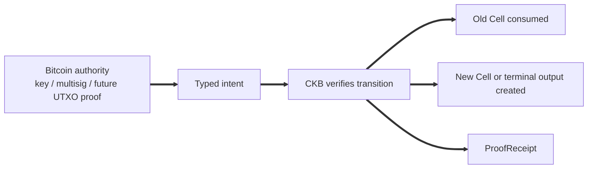
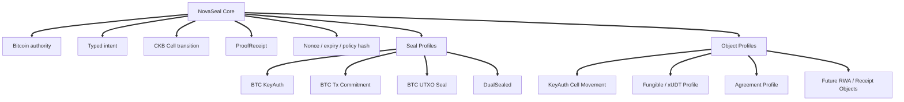
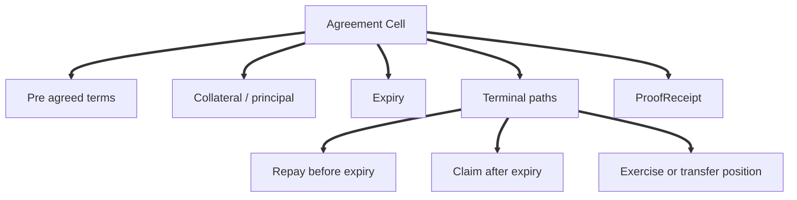
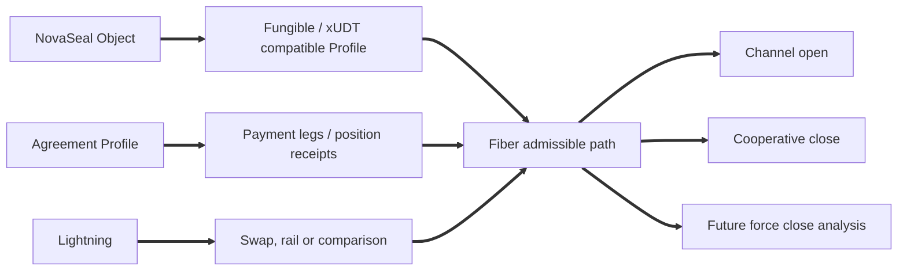

# NovaSeal: A Bitcoin-Authorised Cell Framework for CKB

NovaSeal starts from a fairly simple observation. Bitcoin has the strongest social and monetary authority in the crypto world, while CKB has a Cell model that is unusually good at explicit state, deterministic transitions and auditable terminal outcomes. NovaSeal tries to connect those two strengths without pretending that one chain has magically become the other.

**Bitcoin proves authority. CKB executes state. Fiber moves value. CellScript packages and audits the whole thing.**

That sentence is deliberately modest. NovaSeal is not trying to be every Bitcoin adjacent design at once. It is not just an asset issuance protocol, not a trustless Bitcoin bridge by default, not native Lightning asset transport, not a replacement announcement for RGB++, and not an oracle based DeFi protocol. A better way to read it is as a Bitcoin authorised CKB object framework, where thin core primitives can support richer profiles over time.

The design motto is short because the boundary matters:

**Core stays thin; profiles carry meaning.**

## 1. Why NovaSeal Exists

Many Bitcoin adjacent systems begin from the language of issuance, bridging or layer two execution. Those are useful frames, but they are not the only ones available. NovaSeal begins with a different question: how can Bitcoin side authority, such as a BTC key, a multisig, a transaction commitment or eventually a proved UTXO spend, authorise or condition a CKB native state transition?

CKB is a natural place to ask that question. A Cell is already an explicit object. It can be consumed once, replaced by another object, split into terminal outputs, or checked by separate lock and type logic. That gives CKB a useful vocabulary for financial agreements, receipts, policy hashes, expiry rules and composable assets. It also makes it easier to say exactly what happened after the fact.

NovaSeal is therefore not about copying oracle heavy DeFi designs into a Bitcoin wrapper. The more interesting path is to build Cell native BTCFi objects that are explicit about their authority, their terminal paths and their audit record. If a contract can be settled by pre agreed terms rather than by a continuous off chain price feed, CKB can do something that feels native to its own model rather than borrowed from account based lending pools.

## 2. The Core Idea

The minimal NovaSeal flow is easy to describe in ordinary terms. A CKB object exists as a Cell. A Bitcoin authority signs, or later seals, a typed intent. CKB verifies that the requested transition is allowed. The old Cell is consumed. A new Cell, a terminal output or both are created. A ProofReceipt records the outcome in a way that a builder, wallet, indexer or auditor can inspect later.



In v0, Bitcoin authority should be understood as key or multisig authorisation. That is already useful. It lets a BTC identity move or condition CKB state. Stronger Bitcoin sealing profiles can come later, but they should not be smuggled into the v0 claim.

## 3. NovaSeal Core

NovaSeal core should stay small. Its job is to represent a CKB object whose state can be authorised by Bitcoin side authority, bind a transition to a typed intent, enforce replay and validity boundaries such as nonce and expiry, connect the transition to a policy hash, and produce or check a receipt when the profile requires one.

It should not know what a borrower is. It should not know what a lender is. It should not carry interest rate logic, liquidation rules, collateral ratios, repayment schedules or product names. The moment those ideas enter core, NovaSeal becomes a lending protocol by accident. The cleaner design is to keep core focused on authority, intent, Cell movement and auditability, then let profiles describe the object being moved.

| Core concept | Meaning |
| --- | --- |
| Bitcoin authority | The party or Bitcoin side condition allowed to authorise a Cell transition |
| Typed intent | The canonical message being authorised |
| Cell transition | The CKB state movement being enforced |
| Policy hash | The package or ruleset that defines the valid transition |
| Nonce and expiry | Replay and validity boundaries |
| ProofReceipt | The typed record of the transition and its outcome |
| Seal mode | The strength and form of the Bitcoin side linkage |

This is also why package boundaries matter. NovaSeal should be inspectable as a package surface, not only as a contract blob. A reviewer should be able to see the schemas, fixtures, receipts, proof plan and assumptions that make the object meaningful.

## 4. Seal and Authority Modes

NovaSeal separates authority from sealing. A Bitcoin signature proves that a key or multisig authorised an intent. It does not prove that a particular Bitcoin UTXO was spent. A consumed CKB Cell already gives CKB native linearity, because the old Cell cannot be consumed twice. A spent Bitcoin UTXO can later become a Bitcoin side single use seal, but that is a stronger claim and needs a different proof profile.

**A BTC signature is not a single use seal. It is an authority proof. A true Bitcoin seal requires a Bitcoin UTXO spend to be committed and proven.**

| Mode | Meaning | What it proves | What it does not prove | Stage |
| --- | --- | --- | --- | --- |
| CKB Linear | The old CKB Cell is consumed once | CKB native single use property | Bitcoin finality | v0 |
| BTC KeyAuth | BTC key or multisig signs a typed intent | Bitcoin side authority | BTC UTXO was spent | v0 |
| BTC TxCommitted | BTC transaction commits to a transition | Public Bitcoin commitment | Deep finality by itself | later |
| BTC UTXO Closed | A BTC UTXO spend is proven | Bitcoin single use seal | CKB finality by itself | later |
| DualSealed | BTC UTXO closure and CKB transition both mature | Stronger cross chain finality | Absolute finality under deep reorg | future |
| Fiber Escrowed | Object or balance enters a Fiber compatible path | Channel local settlement path | Arbitrary state channel execution | profile |

This separation keeps the language honest. v0 can be useful without claiming Bitcoin finality. Later profiles can add stronger Bitcoin commitments without forcing every early NovaSeal object to carry that cost.

## 5. Core vs Profiles

The most important design choice is that business meaning lives in profiles. NovaSeal core should tell us how authority, typed intent, Cell transition, replay protection and receipt materialisation fit together. A profile tells us what the object means.

| Layer | Name | Role |
| --- | --- | --- |
| Core | NovaSeal Core | BTC authority, typed intent, Cell transition and receipt |
| Seal profiles | KeyAuth, TxCommit, UTXO Seal | Different strengths of Bitcoin linkage |
| Object profiles | Fungible, Receipt, Agreement | Different kinds of CKB objects |
| Application packages | MVB, RWA, stable receipt, position contract | Concrete use cases built on profiles |



This prevents NovaSeal from becoming 'the lending protocol', 'the RWA protocol' or 'the Bitcoin asset protocol'. It stays a framework. That is less flashy, but it is easier to reason about and much easier to audit.

## 6. Agreement Profile: Replacing Oracles with Agreements

One powerful profile is the Agreement Profile. It turns pre agreed financial terms into deterministic Cell terminal paths. The idea is not to create an Aave style lending pool on CKB, and it should not be described as having solved oracle free lending. It is closer to a pre agreed terminal contract or an option like handshake.

The parties decide the important things upfront: who they are, what assets are involved, what the term is, when it expires, what happens if repayment occurs, what happens if it does not, and what receipt is produced when the path closes. Once those facts are committed, the contract does not need an oracle to keep repricing collateral every block. It only needs to enforce the agreed terminal paths.



This matters because it points towards a different kind of BTCFi on CKB. Rather than asking a protocol to know the live market price of everything, two parties can agree in advance on terminal rights and let Cells enforce the result. That is narrower than a dynamic lending market, but the narrowness is a strength. It gives builders something explicit to test, explain and compose.

## 7. Relationship to RGB++

RGB++ and NovaSeal sit in the same broad design space because both care about Bitcoin authority and CKB execution. The difference is where the abstraction begins.

| Dimension | RGB++ | NovaSeal |
| --- | --- | --- |
| Starting point | Bitcoin UTXO bound into CKB execution | Native CKB objects authorised by Bitcoin |
| First principle | BTC UTXO ownership and commitment | CKB object transitions with pluggable Bitcoin authority |
| Engineering style | Protocol, service and SDK oriented | Package first, receipt first and audit first |
| Bitcoin linkage | UTXO binding and SPV oriented | Staged, with key authorisation first and stronger seals later |
| CKB role | Execution layer for bound assets | Native object and terminal path executor |
| Fiber relation | Plausible through xUDT style assets | Considered from profile design |

NovaSeal should not be presented as a replacement for RGB++. It is a clean room exploration of the same broader design space from a more CKB native, package first angle. That distinction is healthy. It lets NovaSeal learn from existing work without trying to rename it or absorb it.

## 8. Fiber and Lightning

NovaSeal is Fiber ready in design direction, but not Lightning native. Fiber is CKB native, and that makes it the natural channel environment to consider when a NovaSeal object has a balance bearing or xUDT compatible profile. A future profile could move payment legs, position receipts or liquidity paths into Fiber admissible shapes, provided the object model is kept simple enough for channel use.

Lightning is still relevant, but in a different way. It can be a comparison point, a payment rail, or part of a swap or coordination flow. It should not be described as the native asset transport layer for NovaSeal.

**NovaSeal should be described as Fiber ready and Lightning adjacent, not Lightning native.**



The practical implication is simple. NovaSeal should design its balance bearing profiles so Fiber can accept them later. It should not pretend that arbitrary NovaSeal state can already move through channels.

## 9. ProofReceipt and Auditability

ProofReceipt is one of the more useful parts of the NovaSeal mental model. A receipt can record which object moved, which state changed, what intent authorised it, which policy applied, which terminal path was used and what the final outcome was.

That does not make receipts magic logs. A receipt is runtime enforced only if the contract checks it or materialises it as an output Cell. Otherwise it is audit metadata. Metadata can still be valuable, especially for wallets, indexers and review tools, but the distinction should stay visible.

**Receipts must not be treated as magic logs. They are valuable because they are explicit, typed and checkable.**

This is where NovaSeal can feel different from designs that only expose an end state. A typed receipt lets a developer ask: what happened, who authorised it, under which policy, and what assumptions remain outside the contract?

## 10. Developer Experience

The developer experience should be package first. That does not require overclaiming the CLI or pretending all tooling already exists. It means a NovaSeal package should be shaped so a builder can inspect it without reading compiler internals.

```text
novaseal/
  Cell.toml
  src/
    core/
    profiles/
  schemas/
  fixtures/
  proofs/
  docs/
  adapters/
```

The important thing is not the exact directory tree. The important thing is that a developer can find the typed intent, the receipt meaning, the fixture set, the proof plan, the audit bundle and the remaining assumptions. If a wallet is expected to show a signing preimage, that preimage should be clear. If a builder is expected to preserve a payout mapping, that assumption should be named. If a profile is not production ready, the package should say so plainly.

This is also why CellScript is a good fit for the project. The package is not just a pile of scripts. It can carry schemas, fixtures, receipts and audit evidence beside the contract logic, which makes the work more reviewable.

## 11. Security Boundaries

NovaSeal v0 should make useful claims, but only the claims it can support. It can say that BTC key or multisig authority can authorise CKB Cell transitions, that CKB can enforce deterministic state movement, that receipts can record outcomes, and that profiles can express meaningful financial objects.

It should not claim Bitcoin finality, BTC collateral seizure, native Lightning support, trustless bridge semantics, oracle free lending solved, or production mainnet readiness. Those are separate claims, and each needs evidence.

| Risk | Boundary |
| --- | --- |
| BTC key compromise | User custody and multisig policy |
| Wrong intent signing | Canonical typed intent and wallet preview are needed |
| Replay | Nonce, expiry and old Cell binding |
| Fake verifier | Verifier namespace and artefact pinning are required |
| BTC reorg | Not relevant until BTC commitment or SPV profiles |
| CKB reorg | Wait for CKB maturity |
| Receipt mismatch | Receipt must be checked or clearly audit only |
| Fiber overclaim | Balance bearing profiles should come first |

These boundaries are not a weakness. They are the difference between a framework that can grow and a story that sounds complete too early.

## 12. Roadmap

The roadmap should be read as a staged research and package plan, not a promise that each layer is already solved.

| Stage | Focus | Plain meaning |
| --- | --- | --- |
| v0 | KeyAuth Cell Movement | BTC key or multisig authorises a CKB Cell transition |
| v0.1 | Receipt Materialisation | ProofReceipt becomes a checked output Cell |
| v0.2 | Agreement Profile | Pre agreed terminal financial contracts |
| v0.3 | Fungible and Fiber admissible Profile | Balance bearing objects prepared for a Fiber path |
| v0.4 | BTC Commitment Profile | A Bitcoin transaction commits to a NovaSeal transition |
| v1 | BTC UTXO Seal and DualSealed Profile | Proved Bitcoin UTXO closure and stronger cross chain finality |

Each step should advance only when the package evidence is strong enough. That means fixtures, receipts, audit records, verifier pinning where needed, and real review from people who understand both Bitcoin and CKB.

## 13. Final Summary

NovaSeal should be understood as a **Bitcoin authorised Cell framework**.

Its first serious primitive is simple: **BTC multisig moves or conditions a CKB Cell.**

Its most interesting financial profile is also simple to explain: **pre agreed Cell native agreements with no oracle or margin call dependency.**

Its long term promise is BTCFi on CKB through explicit Cells, deterministic terminal paths, receipts and staged Bitcoin sealing.

That promise still has to be earned. NovaSeal should earn protocol status through working packages, fixtures, audit evidence and real usage, not through naming alone.
