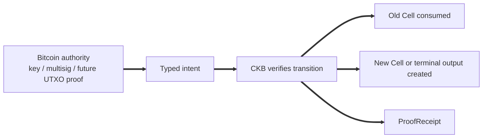
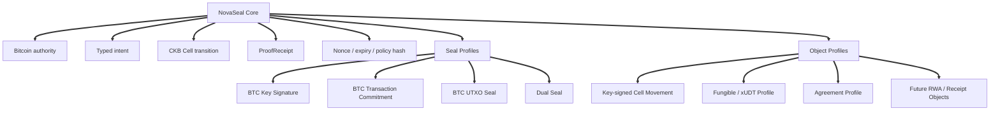
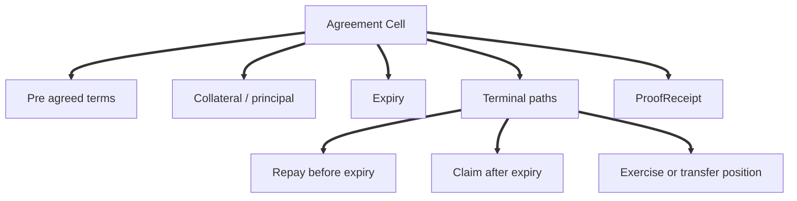
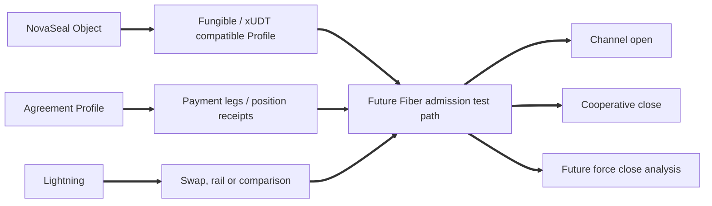

# NovaSeal: A Bitcoin-Authorised Cell Framework for CKB

NovaSeal starts from a narrower observation: Bitcoin keys and UTXOs provide widely understood authority, while CKB's Cell model is well suited to explicit state, deterministic transitions and auditable terminal outcomes. NovaSeal connects those properties without implying that one chain becomes the other.

The working split is: Bitcoin-side authority signs the intent, CKB enforces Cell state, and CellScript packages the evidence.

Rather than acting as an asset issuance protocol, trustless bridge, native Lightning transport layer, or RGB++ replacement, NovaSeal is a Bitcoin authorised CKB object framework. In plain terms, it is a way to let Bitcoin-side approval control a CKB Cell transition. The core remains small; profiles add business meaning later.

This is a research note with local package evidence, not a mainnet launch claim. The current evidence stack is local and devnet-oriented; production claims still require public/shared CellDep attestation, meaning proof that the referenced CKB code dependency is published and pinned, plus external review of the BIP340 Bitcoin signature verifier.

**Core stays thin; profiles carry meaning.**

Some terms below are NovaSeal-specific. We use them in this narrow sense:

| Term | Plain meaning in this post |
| --- | --- |
| Bitcoin authority | A BTC key, multisig, transaction commitment, or later UTXO proof that can approve a CKB transition |
| Typed intent | The exact structured message that a signer approves |
| ProofReceipt | A typed record of what changed and why |
| Seal mode | How strong the Bitcoin-side link is: key signature, transaction commitment, or UTXO-spend proof |
| Profile | A package layer that gives the thin core a concrete meaning, such as an agreement |
| Terminal path | One of the agreed ending branches of a contract, such as repay or claim |
| Proof plan | The package's list of assumptions, checks and evidence obligations |
| Audit bundle | The generated review file that collects the package facts and evidence |

## 1. Problem Statement

Many Bitcoin adjacent systems begin from issuance, bridging or layer two execution. NovaSeal starts with a narrower question: how can Bitcoin side authority, such as a BTC key, multisig, transaction commitment or eventually a proved UTXO spend, authorise or condition a CKB native state transition?

CKB's Cell model natively supports explicit objects. A Cell can be consumed once, replaced, split into terminal outputs, or checked by separate lock and type logic. That provides a strict vocabulary for financial agreements, receipts, policy hashes, expiry rules and composable assets.

Instead of copying oracle-heavy DeFi designs into a Bitcoin wrapper, NovaSeal builds Cell-native financial objects with explicit authority, terminal paths and audit records. Contracts settled by pre agreed terms rather than continuous off chain price feeds fit CKB's object model more directly than account-based lending pools.

## 2. Core Flow

The minimal NovaSeal flow is straightforward. A CKB object exists as a Cell. A Bitcoin authority signs, or later seals, a typed intent. CKB verifies that the requested transition is allowed. The old Cell is consumed. A new Cell, a terminal output or both are created. A ProofReceipt records the outcome for builders, wallets, indexers and auditors.



In v0, Bitcoin authority means key or multisig authorisation. It lets a BTC key holder move or condition CKB state. Stronger Bitcoin sealing profiles can come later, but they should not be smuggled into the v0 claim.

## 3. NovaSeal Core

NovaSeal core should stay small. Its job is to represent a CKB object whose state can be authorised by Bitcoin side authority, bind a transition to a typed intent, enforce replay and validity boundaries such as nonce and expiry, connect the transition to a policy hash, and produce or check a receipt when the profile requires one.

Core should not know what a borrower or lender is. It should not carry interest rate logic, liquidation rules, collateral ratios, repayment schedules or product names. Once those ideas enter core, NovaSeal becomes a lending protocol by accident. Core stays focused on authority, intent, Cell movement and auditability; profiles describe the object being moved.

| Core concept | Meaning |
| --- | --- |
| Bitcoin authority | The party or Bitcoin side condition allowed to authorise a Cell transition |
| Typed intent | The canonical message being authorised |
| Cell transition | The CKB state movement being enforced |
| Policy hash | The package or ruleset that defines the valid transition |
| Nonce and expiry | Replay and validity boundaries |
| ProofReceipt | The typed record of the transition and its outcome |
| Seal mode | The strength and form of the Bitcoin side linkage |

Package boundaries matter. NovaSeal should be inspectable as a package, not only as a compiled contract. A reviewer should be able to see the schemas, fixtures, receipts, proof plan and assumptions that make the object meaningful.

## 4. Seal and Authority Modes

NovaSeal separates authority from sealing. A Bitcoin signature proves that a key or multisig authorised an intent. It does not prove that a particular Bitcoin UTXO was spent. A consumed CKB Cell already gives CKB native linearity, because the old Cell cannot be consumed twice. A spent Bitcoin UTXO can later become a Bitcoin side single use seal, but that is a stronger claim and needs a different verifier and evidence package.

**A BTC signature is not a single use seal. It is an authority proof. A true Bitcoin seal requires a Bitcoin UTXO spend to be committed and proven.**

| Mode | Meaning | What it proves | What it does not prove | Stage |
| --- | --- | --- | --- | --- |
| CKB Linear | The old CKB Cell is consumed once | CKB native single use property | Bitcoin finality | v0 |
| BTC Key Signature | BTC key or multisig signs a typed intent | Bitcoin side authority | BTC UTXO was spent | v0 |
| BTC Transaction Commitment | BTC transaction commits to a transition | Public Bitcoin commitment | Deep finality by itself | later |
| BTC UTXO Seal | A BTC UTXO spend is proven | Bitcoin single use seal | CKB finality by itself | later |
| Dual Seal | BTC UTXO closure and CKB transition both mature | Stronger cross chain finality | Absolute finality under deep reorg | future |
| Future Fiber Test Path | Object or balance enters a Fiber-compatible path | Candidate channel-local settlement path | Arbitrary state channel execution | future profile |

This separation prevents scope creep. v0 remains useful without claiming Bitcoin finality. Later profiles can add stronger Bitcoin commitments without forcing every early NovaSeal object to carry that cost.

## 5. Core vs Profiles

Business meaning lives in profiles. NovaSeal core defines how authority, typed intent, Cell transition, replay protection and receipt output fit together. A profile defines what the object means.

| Layer | Name | Role |
| --- | --- | --- |
| Core | NovaSeal Core | BTC authority, typed intent, Cell transition and receipt |
| Seal profiles | Key signature, transaction commitment, UTXO seal | Different strengths of Bitcoin linkage |
| Object profiles | Fungible, Receipt, Agreement | Different kinds of CKB objects |
| Application packages | MVB, RWA, stable receipt, position contract | Concrete use cases built on profiles |



This prevents scope creep into specific verticals such as lending, RWA or Bitcoin assets, keeping the core framework auditable and composable.

## 6. Agreement Profile: Terminal Paths

Agreement Profile is directly inspired by Matt Quinn's [Minimum Viable Borrowing (MVB) on CKB](https://talk.nervos.org/t/minimum-viable-borrowing-mvb-on-ckb/8627) discussion, and by Phroi's careful pushback in the same thread. Matt supplied the useful spark; Phroi supplied the necessary discipline around naming, incentives and risk.

The core intuition of MVB is not to rebuild Aave without an oracle. The better reading is that two parties can pre agree a finite financial object: one side locks collateral, the other side provides liquidity, the term and fee are fixed in advance, and the contract has a small number of terminal paths. If repayment happens before expiry, one terminal path executes. If expiry arrives without repayment, another path executes. The Cell does not need to know the live market price every block; it needs to enforce what the parties already agreed.

Without margin calls and oracle repricing, this should not be sold as ordinary overcollateralised DeFi lending. It is closer to an option-style contract with pre agreed ending rights. The party who has a profitable ending branch will exercise it; the other party should have priced that possibility before entering the agreement. The model is narrower than a general lending market, but easier to specify and test.

Recent research also questions whether debt, CDP machinery, forced liquidation and real-time oracle assumptions are the right primitives for every financial object; one example is the June 2026 Ethereum Research note on building index-tracking assets on options rather than debt ([Buterin, 2026](https://ethresear.ch/t/building-index-tracking-assets-on-top-of-options-instead-of-debt/25036)). If a design stacks several complex primitives merely to recreate a centralised-finance user experience, the simpler object underneath should be identified first.

For NovaSeal, the conservative first slice is CKB/CKB: CKB collateral and CKB principal. That removes cross-asset price-ratio claims from the protocol surface. BTC authority or a mirrored BTC UTXO, meaning a Bitcoin UTXO represented or proven on the CKB side, can become interesting later as an authority or seal mode, but the Agreement Profile should not smuggle that into v0. The v0 target is narrower: express a finite CKB-native agreement whose state, payout intent and receipt are explicit enough to test.

Economically, that makes borrower optionality the object being priced. The borrower gets temporary liquid CKB while keeping a defined path back to the locked position; the lender gets a pre-agreed return for locking capital under the terminal rules. In the v0 profile there is no fractional reserve, no lender-side commingling, no pool accounting and no hidden liquidation bot. It is intentionally closer to a bilateral instrument than to a lending venue.

The parties decide the important facts upfront: who they are, what assets are involved, what the term is, when it expires, what happens if repayment occurs, what happens if it does not, and what receipt is produced when the path closes. Once those facts are committed, the contract does not need an oracle to keep repricing collateral every block. It only needs to enforce the agreed terminal paths.



This enables a more limited financial model on CKB: rather than asking a protocol to know the live market price of everything, two parties can agree in advance on terminal rights and let Cells enforce the result. The resulting object is narrower than a dynamic lending market, but it gives builders something explicit to test, explain and compose.

The current Agreement Profile is a technical reduction of the MVB idea, not a declaration that MVB is finished. It keeps the part that fits CKB particularly well: pre agreed terms, deterministic terminal paths, typed payout intent and receipts created as output Cells. It leaves the harder extensions, such as BTC collateral, mirrored UTXO authority, iCKB ratios, production wallet flow and market-wide liquidity design, for later evidence-backed profiles.

## 7. Relationship to RGB++

RGB++ and NovaSeal sit in the same broad design space because both care about Bitcoin authority and CKB execution. The difference is where the abstraction begins.

| Dimension | RGB++ | NovaSeal |
| --- | --- | --- |
| Starting point | Bitcoin UTXO bound into CKB execution | Native CKB objects authorised by Bitcoin |
| First principle | BTC UTXO ownership and commitment | CKB object transitions with pluggable Bitcoin authority |
| Engineering style | Protocol, service and SDK oriented | Package first, receipt first and audit first |
| Bitcoin linkage | UTXO binding and SPV oriented | Staged, with key authorisation first and stronger seals later |
| CKB role | Execution layer for bound assets | Native object and terminal path executor |
| Fiber relation | Plausible through xUDT style assets | Considered from profile design |

NovaSeal should not be presented as a replacement for RGB++. It is a clean room exploration of the same broader design space from a more CKB native, package first angle. This keeps the scope distinct, allowing NovaSeal to build alongside existing protocols without overlapping unnecessarily.

## 8. Fiber and Lightning

NovaSeal considers Fiber in its design direction, but it does not integrate with Fiber yet and is not Lightning native. Because Fiber is CKB-native, it is the channel system to test once a future NovaSeal object has a balance-bearing or xUDT-compatible profile. A future profile could move payment legs, position receipts or liquidity paths towards shapes that Fiber can evaluate for admission, provided the object model is kept simple enough for channel use.

Lightning remains relevant as a comparison point, payment rail, or part of a swap or coordination flow. It should not be described as the native asset transport layer for NovaSeal.

**Description boundary: Fiber considered, Lightning adjacent; no Fiber or Lightning integration yet.**



NovaSeal should design balance-bearing profiles so later Fiber admission testing has concrete layouts to evaluate. Arbitrary NovaSeal state should not be described as channel-ready.

## 9. ProofReceipt and Auditability

ProofReceipt records which object moved, which state changed, what intent authorised it, which policy applied, which terminal path was used and what the final outcome was.

Receipts are not magic logs. A receipt is runtime enforced only if the contract checks it or materialises it as an output Cell. Otherwise it is audit metadata. Metadata can still be valuable, especially for wallets, indexers and review tools, but the distinction should stay visible.

**Receipts must not be treated as magic logs. They are valuable because they are explicit, typed and checkable.**

A typed receipt exposes more than an end state: what happened, who authorised it, which policy applied, and which assumptions remain outside the contract.

## 10. Developer Experience

We want the developer experience to be package first. We should not overclaim the CLI or pretend all tooling already exists. The narrower goal is to shape a NovaSeal package so a builder can inspect it without reading compiler internals.

```text
novaseal/
  Cell.toml
  src/
    core/
    profiles/
  schemas/
  fixtures/
  proofs/
  docs/
  adapters/
```

The exact directory tree is flexible; the requirement is that a developer can locate the typed intent, receipt meaning, fixture set, proof plan, audit bundle and remaining assumptions. If a wallet is expected to show a signing preimage, that preimage should be clear. If a builder is expected to preserve a payout mapping, that assumption should be named. If a profile is not production ready, the package should say so plainly.

CellScript fits this project because the package is not just a pile of scripts. It can carry schemas, fixtures, receipts and audit evidence beside the contract logic, which makes the work more reviewable.

## 11. Security Boundaries

NovaSeal v0 should claim only what the current evidence supports. It can say that BTC key or multisig authority can authorise CKB Cell transitions, that CKB can enforce deterministic state movement, that receipts can record outcomes, and that profiles can express specific financial objects.

It should not claim Bitcoin finality, BTC collateral seizure, native Lightning support, trustless bridge semantics, oracle free lending solved, or production mainnet readiness. Those are separate claims, and each needs evidence.

| Risk | Boundary |
| --- | --- |
| BTC key compromise | User custody and multisig policy |
| Wrong intent signing | Canonical typed intent and clear wallet display are needed |
| Replay | Nonce, expiry and old Cell binding |
| Fake verifier | Verifier namespace and artefact pinning are required |
| BTC reorg | Not relevant until BTC commitment or SPV profiles |
| CKB reorg | Wait for CKB maturity |
| Receipt mismatch | Receipt must be checked or clearly audit only |
| Fiber overclaim | Balance-bearing profiles should come first |

Defining these boundaries early prevents over-claiming and keeps the v0 implementation strictly verifiable.

## 12. Roadmap

| Stage | Focus | Progress | Status | Plain meaning |
| --- | --- | --- | --- | --- |
| v0 | Key-signed Cell Movement | `[##########] 100%` | complete in local/devnet evidence | BTC key or multisig authorises a CKB Cell transition |
| v0.1 | Receipt Output | `[##########] 100%` | complete in local/devnet evidence | ProofReceipt becomes a checked output Cell |
| v0.2 | Agreement Profile | `[##########] 100%` | complete in local/devnet evidence | Pre agreed terminal financial contracts |
| v0.3 | Fungible Profile for Fiber Testing | `[----------] 0%` | separate planning needed | Balance-bearing objects prepared for later Fiber admission testing |
| v0.4 | BTC Commitment Profile | `[----------] 0%` | separate planning needed | A Bitcoin transaction commits to a NovaSeal transition |
| v1 | BTC UTXO Seal and Dual Seal Profile | `[----------] 0%` | separate planning needed | Proved Bitcoin UTXO closure and stronger cross chain finality |

The roadmap should be read as a staged research and package plan. The first three stages are marked complete for the current NovaSeal package and the local/devnet evidence we have today, not as production or mainnet claims. That pace was possible because CellScript has recently become a steadier DSL to build on.
