# CellScript 0.22 No-Profile Fiber Native Support Plan

**Status**: Proposed; not implemented and not release evidence

**Updated**: 2026-07-20

**Scope**: native use of structurally compatible CellScript fungible Type
Scripts in Fiber channels, without a user-authored Fiber profile and without a
Fiber fork

**Depends on**: the existing CellScript compiler metadata, checked-runtime
type-group conservation, `cellscript-ckb-adapter`, deployment manifests, and
builder-backed CKB evidence

## Executive Decision

CellScript should not introduce a Fiber-specific profile language.

The user supplies a normal `.cell` package. A dedicated adapter derives Fiber
compatibility from existing typed compiler evidence, deploys or resolves the
compiled Type Script, materialises the corresponding Fiber UDT configuration,
and runs the required CKB/Fiber acceptance matrix.

The intended operator flow is:

```bash
cellscript-fiber check token.cell
cellscript-fiber enable token.cell --auto-accept 100000000
```

The second command may consume the repository's ordinary CKB deployment and
node configuration, but it must not require a Fiber schema, compatibility
manifest, source annotation, or hand-written JSON input.

In this document, **no-profile** means no user-authored Fiber compatibility
profile. It does not remove CellScript's existing internal `ckb` target policy.
The adapter selects that target internally and keeps it out of the Fiber-facing
authoring experience.

This plan explicitly forbids the following user-facing inputs:

- `fiber-profile.json` or `fiber.toml`;
- a `[fiber]` section in `Cell.toml`;
- `#[fiber_asset]` or other Fiber-specific source annotations;
- a `profile_id` or compatibility certificate supplied as an input;
- user-maintained Script, CellDep, data-layout, or transaction-template JSON.

Generated compatibility and acceptance reports are outputs. They are not
profiles, cannot override compiler facts, and must never become an input that
changes contract semantics.

## Meaning Of Native Support

For the first release, native support means:

> A structurally compatible CellScript fungible Type Script can be compiled,
> checked, deployed or resolved, registered through a Fiber node's ordinary
> startup UDT configuration, used through the supported channel lifecycle, and
> bound to reproducible CKB/Fiber evidence without modifying Fiber or asking the
> contract author to maintain a second description of the asset.

Fiber does not parse CellScript source, IR, metadata, or generated reports. At
the protocol boundary it continues to see only normal CKB objects:

- a Type Script;
- static CellDeps;
- Cell data containing the fungible amount;
- funding, commitment, settlement, and close transactions.

Native support therefore means native interoperability at the CKB Script and
transaction boundary. It does not mean embedding the CellScript compiler into a
Fiber node.

## Current Fiber Boundary

This plan uses the Fiber source at commit
[`04e091b08953368aa5ee977f562ad628c3000ff4`](https://github.com/nervosnetwork/fiber/tree/04e091b08953368aa5ee977f562ad628c3000ff4)
as its dated design baseline. The implementation must revalidate these facts
against the pinned Fiber revision used by its acceptance environment.

Current relevant behavior is:

1. Fiber accepts configured UDTs through `CkbConfig.udt_whitelist`; each
   `UdtArgInfo` carries a name, a Script matcher, an auto-accept amount, and
   CellDeps. The args matcher is a regular expression over the complete
   `0x`-prefixed Script args string, and the implementation does not add exact
   match anchors. See the
   [configuration definition](https://github.com/nervosnetwork/fiber/blob/04e091b08953368aa5ee977f562ad628c3000ff4/crates/fiber-lib/src/ckb/config.rs#L45-L51),
   the
   [matcher implementation](https://github.com/nervosnetwork/fiber/blob/04e091b08953368aa5ee977f562ad628c3000ff4/crates/fiber-lib/src/ckb/config.rs#L169-L200),
   and the
   [official configuration reference](https://www.fiber.world/docs/operate/config-reference#udt-configuration).
2. The whitelist is loaded into Fiber's contracts context during node startup
   and is included in signed node announcements. The audited RPC surface has no
   generic UDT import, removal, or configuration-reload method. Configuration
   changes therefore require an ordinary node restart at this baseline. See
   [startup initialisation](https://github.com/nervosnetwork/fiber/blob/04e091b08953368aa5ee977f562ad628c3000ff4/crates/fiber-bin/src/main.rs#L209-L218),
   [node announcements](https://github.com/nervosnetwork/fiber/blob/04e091b08953368aa5ee977f562ad628c3000ff4/crates/fiber-types/src/protocol.rs#L603-L681),
   and the
   [official RPC method index](https://github.com/nervosnetwork/fiber/blob/04e091b08953368aa5ee977f562ad628c3000ff4/crates/fiber-lib/src/rpc/README.md#rpc-methods).
3. Fiber constructs every new funding, change, commitment, shutdown, and
   settlement UDT output as exactly one 16-byte little-endian `u128`. Some
   collection and observation paths accept Cell data of at least 16 bytes and
   read only the first 16 bytes. A longer input can therefore lose its trailing
   bytes when Fiber emits the next output. See
   [funding output construction](https://github.com/nervosnetwork/fiber/blob/04e091b08953368aa5ee977f562ad628c3000ff4/crates/fiber-lib/src/ckb/funding/funding_tx.rs#L283-L322),
   [input collection](https://github.com/nervosnetwork/fiber/blob/04e091b08953368aa5ee977f562ad628c3000ff4/crates/fiber-lib/src/ckb/funding/funding_tx.rs#L410-L472),
   and
   [shutdown output construction](https://github.com/nervosnetwork/fiber/blob/04e091b08953368aa5ee977f562ad628c3000ff4/crates/fiber-lib/src/fiber/channel.rs#L9193-L9231).
4. Routing requires the payment's concrete UDT Type Script to equal the Type
   Script recorded on every selected channel. A local whitelist entry does not
   create remote support, channel liquidity, or a multi-hop route. The
   [official stablecoin guide](https://www.fiber.world/docs/quick-start/transfer-stablecoin)
   configures every participating node, opens a UDT channel on each route leg,
   and waits for gossip convergence.
5. Fiber already prepends an xUDT-compatible WitnessArgs encoding to funding,
   commitment, and watchtower witnesses. A compatible CellScript Type Script
   must tolerate those bytes; "no custom witness" does not mean that the
   witness is empty. See the
   [witness encoding](https://github.com/nervosnetwork/fiber/blob/04e091b08953368aa5ee977f562ad628c3000ff4/crates/fiber-lib/src/fiber/channel.rs#L9850-L9877).
6. An externally funded transaction is frozen after Fiber returns it for
   signing; an external signer may fill witnesses but must not rewrite inputs,
   outputs, output data, or CellDeps. See
   [external funding](https://github.com/nervosnetwork/fiber/blob/04e091b08953368aa5ee977f562ad628c3000ff4/docs/external-funding.md#L3-L11).
7. Type-ID CellDeps are resolved during startup, but direct CellDep liveness is
   not an end-to-end compatibility proof. The adapter must independently prove
   that every resolved dependency is live and that the concrete Fiber-generated
   transactions contain the expected dependency set.

These facts imply a narrow but useful first boundary: a CellScript asset can be
used without Fiber changes when its compiled Type Script accepts the exact
transactions, witnesses, amount layout, dependency closure, and topology that
Fiber already constructs. Fiber is not a generic CellScript or arbitrary Type
Script interpreter.

The official stablecoin guide was published for Fiber `0.9.0-rc5`, while the
audited parent implementation identifies as `0.9.0-rc7`. Source-level evidence
therefore takes precedence for this baseline, and every supported release must
rerun the same inventory against its pinned revision.

### Audited Design Decisions

| Question | Decision |
|---|---|
| Does Fiber interpret CellScript metadata or actions? | No. Fiber sees a normal concrete CKB Type Script, CellDeps, Cell data, and transactions. |
| Does the author provide a Fiber profile? | No. The adapter derives a bounded compatibility result from typed compiler and live-chain evidence. |
| Which entry executes? | A dedicated chain-neutral `fungible-type-group-v1` invariant entry, never an ordinary business action selected by name or superficial shape. |
| Which Cell data is accepted? | Exactly 16 bytes containing one little-endian `u128`; longer data is rejected because Fiber would discard trailing state when it regenerates outputs. |
| Where do asset Script args come from? | A materialised ordinary CKB action plan or a verified live asset Cell, not the code Cell's deployment TYPE_ID args. |
| How is the Fiber matcher encoded? | Regex-escaped complete args text with explicit `^` and `$` anchors and positive/negative match-set tests. |
| Can the running node hot-load the asset? | Not at the audited baseline. The adapter generates an overlay and reports a required operator-controlled restart. |
| What proves multi-hop readiness? | Separate topology evidence covering all participating announcements, exact-asset route channels, liquidity, CKB reserve, and gossip convergence. |
| Must the witness be empty? | No. The entry requires no CellScript payload but must tolerate Fiber's existing xUDT-compatible witness bytes. |
| Does a deployment manifest prove CellDeps are usable? | No. Every direct and Type-ID dependency is live-verified, then observed again in actual Fiber-generated transactions. |

## Supported V1 Asset Contract

The first implementation supports only fungible CellScript Type Scripts with
all of the following properties:

| Requirement | Evidence required |
|---|---|
| CKB artifact | Valid RISC-V ELF under the existing `ckb` target policy |
| Cell data | Exactly 16 bytes in every Fiber-managed asset Cell |
| Amount | One `u128`, little-endian, beginning at byte offset zero |
| Script group | Conservation is evaluated over the complete CKB type group |
| Arithmetic | Checked `u128` accumulation with overflow rejection |
| Transfer shape | Supports `N` inputs to `M` outputs, including split, merge, and change |
| Entry ABI | Uses a dedicated payload-free, chain-neutral invariant entry; requires no CellScript action selector |
| Witnesses | Tolerates Fiber's existing xUDT-compatible witness bytes and requires no additional application witness |
| Dependencies | Uses a finite, deployment-manifest-backed CellDep set |
| Transaction shape | Does not require fixed global output indexes or non-Fiber outputs |
| Environment | Does not require dynamic HeaderDeps, oracle Cells, or ambient chain reads |
| Supply | Does not mint or burn on the Fiber channel path |

The analyzer must validate the emitted cell-data codec, not infer the layout
from a field name. A source type named `Token` or a field named `amount` carries
no authority by itself.

The exact-16 requirement is deliberately stricter than some Fiber input
collection paths. It is a losslessness requirement: Fiber canonicalises newly
created UDT outputs to 16 bytes, so accepting a longer Cell would silently
discard application state beyond the amount prefix.

The v1 boundary intentionally excludes:

- NFTs and other non-fungible Cells;
- state machines that mutate application data during every transfer;
- assets whose data contains a symbol, owner, flags, or any bytes beyond the
  16-byte amount;
- transfer rules that require an application-specific witness;
- dynamic CellDep or HeaderDep discovery;
- fixed output-index requirements;
- custom commitment, receipt, or application-message protocols;
- arbitrary CellScript contracts that merely happen to compile for CKB.

Unsupported forms must fail closed with a reason. The adapter must not silently
fall back to a generic "probably compatible" mode.

## No-Profile Compatibility Derivation

### Inputs Already Owned By CellScript

The analyzer consumes existing compiler and adapter facts:

- typed AST and IR;
- `CompileMetadata` and its component schema versions;
- `cell_data_codec_manifest` and Molecule/layout metadata;
- capability and lifecycle metadata;
- ProofPlan records and their evidence tiers;
- builder assumptions and CKB constraints;
- compiled artifact and artifact hash;
- `DeploymentManifest` and its resolved CellDeps.

No second source of truth is introduced.

### Structural Asset Selection

The analyzer identifies candidates by structure:

1. find persistent types whose emitted data codec is exactly one 16-byte
   `u128` value;
2. find type-group invariants that cover all inputs and outputs of that exact
   type;
3. require checked-runtime conservation evidence for the selected artifact;
4. prove that the invariant can be lowered into the dedicated payload-free
   fungible verifier entry without importing action-specific lifecycle logic;
5. reject zero candidates and reject ambiguity between multiple candidates.

The analyzer must not match names such as `token`, `transfer`, `fiber`,
`amount`, or `xudt`. If generic compiler metadata is insufficient to make one
of these decisions, the implementation must first add a structured,
chain-neutral compiler fact. It must not add Fiber-specific name heuristics.

### Dedicated Chain-Neutral Verifier Entry

Fiber does not provide a CellScript action selector or `CSARGv1` entry payload.
The adapter must therefore compile a structurally selected verifier entry that
requires no external payload.

The implementation must not reuse an ordinary business action merely because
that action is named or shaped like a transfer. An ordinary action may still
encode one consumed Cell, one created Cell, fixed output relations, witness
parameters, or other lifecycle behavior that Fiber does not reproduce.

The compiler instead introduces an internal, chain-neutral
`fungible-type-group-v1` entry contract. It is derived from an existing typed
aggregate invariant and emits only the following consensus behavior:

```text
for every Cell in the current Type Script input and output groups:
    require data.length == 16
    decode amount as u128 little-endian
    add with checked u128 arithmetic

require sum(inputs) == sum(outputs)
require input group is non-empty
require output group is non-empty
return success
```

The entry:

- has no externally supplied CellScript parameters or entry envelope;
- does not execute an ordinary action body;
- does not require the Fiber witness to be empty and does not parse its
  xUDT-compatible prefix;
- carries emitted-helper and ProofPlan evidence tied to the exact artifact;
- rejects mint, burn, malformed data, and checked-sum overflow;
- contains no Fiber-specific action names or source annotations.

The compiler may reuse its existing direct-entry and runtime-helper machinery,
but the semantic entry selection is a new invariant compilation path, not a
normal selected-action wrapper. If the contract needs any additional business
rule or custom witness on the channel path, it is incompatible with v1. The
adapter must not fabricate or inject a witness after Fiber has frozen the
transaction.

### Conservation Must Cover Real Fiber Shapes

The existing runtime helper already scans the complete CKB Type Script group,
enforces exact 16-byte data, uses checked `u128` accumulation, and therefore
implements the required `N -> M` arithmetic. The current automatic insertion
path is narrower: it attaches the helper only when an ordinary action is
recognised as a one-input/one-output amount-preserving action.

The missing work is to promote that helper into the dedicated chain-neutral
entry and bind its emitted coverage to the selected invariant and artifact:

```text
sum_u128(group_inputs.data[0..16])
    ==
sum_u128(group_outputs.data[0..16])
```

Both sums must reject overflow. Empty input/output groups must follow explicit
CKB Type Script creation/destruction rules and must not accidentally authorise
mint or burn. The `fungible-type-group-v1` entry rejects those paths unless a
later, separately evidenced scope deliberately adds them.

### Compatibility Result

The derived result is an adapter-owned type:

```rust
enum FiberCompatibility {
    Compatible(FiberAssetDescriptor),
    Incompatible(Vec<FiberDiagnostic>),
    RequiresRuntimeEvidence(Vec<FiberDiagnostic>),
}
```

`RequiresRuntimeEvidence` is not permission to configure a production node. It
allows the test harness to continue toward concrete evidence; `enable` may
proceed only after that evidence passes.

The descriptor is generated in memory and written only as a build artifact for
inspection. It is not checked into the package and cannot be supplied back to
the compiler as authority.

## Architecture

Add a separate workspace crate instead of adding Fiber networking to the root
compiler:

```text
crates/cellscript-fiber-adapter/
├── Cargo.toml
├── src/
│   ├── lib.rs
│   ├── compat.rs
│   ├── descriptor.rs
│   ├── deployment.rs
│   ├── fiber_config.rs
│   ├── fiber_rpc.rs
│   ├── evidence.rs
│   └── bin/cellscript-fiber.rs
└── tests/
```

The dependency direction is:

```mermaid
flowchart LR
    Source["CellScript source"] --> Compiler["cellscript compiler"]
    Compiler --> Metadata["Typed metadata and invariant artifact"]
    Metadata --> Analyzer["Compatibility analyzer"]
    Analyzer --> Adapter["cellscript-fiber-adapter"]
    CkbAdapter["cellscript-ckb-adapter"] --> Adapter
    Adapter --> Deployment["Code deployment identity"]
    Adapter --> Asset["Resolved asset Script instance"]
    Deployment --> Config["Generated Fiber UDT configuration"]
    Asset --> Config
    Config --> Fiber["Existing Fiber node"]
    Fiber --> Local["Local registration and announcement"]
    Local --> Topology["Channel topology certification"]
    Topology --> Matrix["Funding, payment, and close matrix"]
    Matrix --> Evidence["Generated acceptance evidence"]
```



This boundary prevents:

- a dependency cycle between the compiler and CKB adapter;
- Fiber RPC and HTTP dependencies entering the offline compiler;
- native networking dependencies entering `cellscript-wasm`;
- a direct dependency on unstable `fiber-lib` internals;
- Fiber-specific fields inflating every browser-serialised
  `CompileMetadata` object.

The Fiber adapter should define only the minimum stable JSON-RPC and
configuration DTOs it consumes. It must pin and record the Fiber revision used
for acceptance instead of importing Fiber's internal Rust crates.

The adapter must also keep these identities distinct:

- the CellScript source package and selected typed invariant;
- the compiled `fungible-type-group-v1` artifact;
- the live code Cell and its CellDep identity;
- the concrete asset Type Script instance used by channels;
- the local Fiber node configuration and announcement;
- the tested multi-node channel topology.

Equality or hash binding inside one layer must not be used as evidence for a
different layer.

## Operator Experience

### Check

```bash
cellscript-fiber check token.cell
```

`check` performs compilation, structured compatibility derivation, artifact
verification, and dependency closure without changing the chain or a Fiber
node. Diagnostics name the exact failed boundary and the next valid action.

Example failure:

```text
FBR1003: Fiber v1 requires exactly 16 bytes of Cell data, but Asset encodes 24
bytes. Keep only the u128 amount in the Fiber-managed Type Script or use a
separate application Cell outside this integration boundary.
```

### Enable

```bash
cellscript-fiber enable token.cell --auto-accept 100000000
```

`enable` performs the following steps:

1. run `check`;
2. resolve an existing deployment or prepare an explicitly authorised
   deployment through `cellscript-ckb-adapter`;
3. bind the artifact hash to the live code Cell;
4. resolve one concrete asset Type Script independently of the code Cell's
   deployment TYPE_ID;
5. derive an exact Type Script matcher and live-verified CellDeps;
6. generate a Fiber `UdtArgInfo` entry and deterministic configuration overlay;
7. report `LocalNodeConfiguredRestartRequired` for the audited Fiber baseline;
8. after an operator-controlled restart, verify the node's local info and
   signed announcement;
9. optionally run channel and topology certification when all required nodes
   and funding authority are in scope;
10. emit the compatibility, registration, topology, and acceptance reports.

The command must not silently sign, submit, rewrite a user-owned Fiber config,
or restart a node without the operator's explicit normal deployment authority.
No-profile removes duplicate semantic configuration; it does not remove safe
authorization boundaries.

At the audited baseline, `enable` must not claim to have installed a UDT in a
running node. Fiber has no generic hot-load RPC, so generating a valid overlay
and reporting the required restart is the successful result before the operator
restarts the node. A future hot-load path must be capability-detected and
version-pinned; it cannot be inferred from the presence of an RPC endpoint.

`auto_accept_amount` is node policy, not contract semantics. It is supplied as
an operator flag or inherited from the node's ordinary policy configuration and
must never be guessed from source code.

### Optional Diagnostic Subcommands

The following subcommands may exist for debugging while `enable` remains the
normal path:

```text
cellscript-fiber check
cellscript-fiber deploy
cellscript-fiber configure
cellscript-fiber doctor
cellscript-fiber accept
```

They decompose the same pipeline. They do not introduce independent schemas or
alternative compatibility truth.

## Fiber Configuration Materialisation

### Code Deployment Identity Is Not Asset Identity

The existing `DeploymentManifest` records the on-chain code Cell and the
CellDep needed to execute that code. Its `args` field records the code Cell's
TYPE_ID args for that deployment path. Those bytes are not automatically the
args of a fungible asset Type Script instance.

The adapter therefore requires a separate, generic resolved value:

```rust
struct ResolvedAssetScript {
    code_hash: [u8; 32],
    hash_type: ScriptHashType,
    args: Vec<u8>,
    source: ResolvedAssetScriptSource,
}

enum ResolvedAssetScriptSource {
    MaterializedActionPlan,
    VerifiedLiveAssetCell,
}
```

This is an ordinary CKB Script value, not a Fiber profile. It may be derived
from a fully materialised action plan or from a uniquely selected live asset
Cell whose code identity is bound to the deployment. Compiler templates,
code-cell TYPE_ID args, package names, and unverified operator strings are not
sufficient. Ambiguity or absence fails closed.

The adapter derives `UdtArgInfo` as follows:

| Fiber field | Source |
|---|---|
| `name` | canonical CellScript package/type display identity |
| `script.code_hash` | `ResolvedAssetScript.code_hash`, verified against the live code deployment |
| `script.hash_type` | `ResolvedAssetScript.hash_type` |
| `script.args` matcher | regex-escaped `ResolvedAssetScript.args`, surrounded by `^` and `$` over the complete `0x`-prefixed hex string |
| `cell_deps` | deployment manifest plus live-verified static dependency closure |
| `auto_accept_amount` | explicit operator policy |

The generated configuration must be deterministic and hash-bound to the
artifact, code deployment identity, concrete asset Script, live CellDeps,
target network, and pinned Fiber configuration schema.

The adapter must compile the matcher before writing the overlay, prove that it
matches the intended args exactly, and prove that it rejects representative
prefix, suffix, empty, and neighbouring values. It must never emit an unanchored
literal, `0x.*`, an invalid expression, or a matcher widened to work around
unresolved args.

Each generated dependency entry must contain exactly one of `type_id` and
`cell_dep`. For a direct outpoint, the adapter verifies the live Cell, data or
type identity, and `dep_type` on the target network. For a Type ID, it records
and verifies the resolved live outpoint. The acceptance harness must also
inspect the final Fiber-built funding, commitment, shutdown, and settlement
transactions instead of assuming that configuration presence proves CellDep
inclusion.

The current installation result is:

- `LocalNodeConfiguredRestartRequired`: a generated overlay is ready, but the
  operator must load it through the node's ordinary startup configuration.

A future upstream generic UDT import/remove RPC may add a capability-negotiated
`LocalNodeInstalled` result. It is an operational improvement, not a prerequisite
or compatibility loophole.

## Operational States And Topology Certification

The adapter reports monotonic evidence states instead of one overloaded
`enabled` boolean:

```text
StaticallyCompatible
ArtifactDeployed
AssetScriptResolved
LocalNodeConfiguredRestartRequired
LocalNodeAdvertised
ChannelReady
TopologyCertified
```

Later states require all earlier evidence for the same source, artifact,
network, asset Script, Fiber revision, and configuration hash. A generated
overlay never implies `LocalNodeAdvertised`, and one advertised node never
implies `TopologyCertified`.

Local registration verifies:

- the restarted node reports the exact UDT configuration through local info;
- its signed node announcement contains the intended exact matcher, CellDeps,
  and auto-accept policy;
- the RPC endpoint is local or explicitly trusted and authenticated;
- the adapter neither reads nor stores the Fiber node's private key.

Topology certification additionally verifies:

- every controlled endpoint node is registered for the same concrete asset
  Script;
- every required remote node advertises compatible UDT information, while
  recognising that the adapter cannot configure third-party nodes;
- every route leg is an open, ready channel with the exact same Type Script;
- the intended direction has sufficient UDT liquidity and version-specific CKB
  reserve for capacity, shutdown, and fees;
- the graph has converged after node and channel announcements;
- a concrete direct or multi-hop payment succeeds through the certified route.

The official example's approximately 99 CKB per-node requirement is useful
operator guidance, not a permanent constant. Preflight must calculate or read
the requirement for the pinned Fiber version and concrete channel parameters.

## Evidence Model

### Generated Reports

Write generated outputs under an ignored build directory such as:

```text
target/cellscript-fiber/<network>/<asset-id>/
├── compatibility.json
├── deployment.json
├── asset-script.json
├── udt-config.json
├── registration.json
├── topology.json
└── acceptance.json
```

`FiberCompatibilityReportV1` should include:

```text
schema and version
status
source and source hash
compiler version and metadata schema versions
artifact hash and target policy
selected type, selected invariant, and generated entry contract
cell-data codec identity
amount offset, width, and endianness
conservation and overflow evidence
entry witness requirements
builder assumptions
code deployment manifest hash and live code Cell outpoint
resolved asset Type Script, resolution source, and exact matcher tests
resolved live CellDeps and final-transaction CellDep observations
Fiber revision, Fiber Scripts identities, and configuration schema
CKB revision and network identity
local registration state, node announcement, and configuration hash
channel graph, route legs, liquidity, reserve, and gossip convergence
static, CKB-VM, tx-pool, and Fiber matrix results
```

The report must distinguish these evidence levels:

| Level | What it proves |
|---|---|
| Static compatibility | Compiler metadata and artifact satisfy the declared structural contract |
| CKB-VM acceptance | Selected valid/invalid transactions execute as expected in the VM |
| CKB node acceptance | Concrete transactions pass node dry-run or tx-pool validation |
| Fiber end-to-end acceptance | A pinned Fiber topology completes the tested channel lifecycle |

No lower level may be presented as a higher one.

### Immutability And Authority

Reports are append-only evidence for an exact artifact and environment. A
change in source hash, compiler version, artifact hash, code deployment, asset
Script, CellDeps, Fiber revision, Fiber Scripts deployment identities, CKB
revision, node configuration, or test topology invalidates reuse of the old
report.

The report cannot waive a failed compiler check. There is no
`--trust-profile`, `--force-compatible`, or metadata-edit escape hatch.

## Acceptance Matrix

The integration is not complete until the same compiled artifact passes the
following matrix.

### Positive Cases

- deploy the exact invariant artifact and verify the live code Cell;
- resolve the concrete asset Type Script independently of the code Cell's
  TYPE_ID args;
- compile the exact anchored args matcher and prove its match/rejection set;
- resolve direct and Type-ID CellDeps to live Cells on the target network;
- generate the overlay, restart every controlled node, and verify local info and
  signed node announcements;
- fund a channel from one asset input;
- fund from multiple asset inputs and produce change;
- manual channel acceptance;
- auto-accept within the configured operator limit;
- direct UDT payment;
- multi-hop routed UDT payment where every route leg uses the same concrete
  Type Script and the graph has converged;
- multiple payments that exercise split and merge behavior;
- cooperative shutdown;
- force close without a pending TLC;
- force close with a pending UDT TLC;
- watchtower-driven settlement where supported by the topology;
- execution with Fiber's exact xUDT-compatible funding, commitment, and
  watchtower witness encodings;
- inspection of the final Fiber-generated transaction CellDeps for every
  on-chain lifecycle path;
- node restart and channel reestablishment;
- replay the generated transaction set through CKB-VM and node acceptance.

### Negative Cases

- Cell data shorter than 16 bytes;
- Cell data longer than 16 bytes, including an input that Fiber's collector
  would otherwise read by its first 16-byte prefix;
- wrong Type Script or Script args;
- invalid, unanchored, wildcard, prefix-matching, suffix-matching, or
  over-broad args regex;
- code-cell TYPE_ID args incorrectly reused as asset Type Script args;
- a direct CellDep outpoint that is dead, replaced, or has the wrong identity;
- a Type-ID CellDep that is unresolved or resolves to an unexpected Cell;
- a dependency entry with both or neither of `type_id` and `cell_dep`;
- missing or mismatched CellDep in an actual Fiber-generated transaction;
- input/output amount mismatch;
- checked-sum overflow;
- an attempted mint path;
- an attempted burn path;
- a required custom entry witness;
- an entry that incorrectly assumes the Fiber witness is empty;
- a required HeaderDep or dynamic oracle Cell;
- a fixed output topology that Fiber does not create;
- insufficient CKB capacity;
- insufficient channel liquidity;
- a participating node whose whitelist or announcement lacks the asset;
- an intermediate route channel with a different UDT Type Script;
- an otherwise valid topology whose node/channel gossip has not converged;
- a configuration change reported as installed without the required restart;
- an untrusted or unauthenticated remote RPC endpoint;
- restart or upgrade with incompatible persisted channel state or configuration
  drift;
- tampered artifact, deployment manifest, or generated UDT configuration;
- a Fiber, Fiber Scripts, or CKB revision outside the accepted compatibility
  window.

### Claim Boundary

Compile success, whitelist generation, or a successful channel open is not
enough. Native-support acceptance requires the positive lifecycle matrix, the
negative rejection matrix, exact-artifact CKB evidence, and pinned environment
provenance.

## Implementation Work Packages

### Phase 0: Freeze The Contract

Deliverables:

- this roadmap accepted as the scope boundary;
- a pinned Fiber behavior inventory;
- a versioned, adapter-owned `FiberCompatibility` result;
- a versioned `fungible-type-group-v1` invariant-entry contract;
- separate code-deployment, asset-Script, local-registration, and topology
  evidence identities;
- the monotonic operational-state model;
- diagnostic codes for every v1 rejection class;
- fixtures proving that no Fiber-specific profile or annotation is read.

Exit gate:

- every compatibility decision is mapped to an existing typed fact or to a
  named generic compiler evidence gap;
- no decision relies on source names or untrusted generated JSON.

### Phase 1: Static Compatibility Analyzer

Deliverables:

- exact 16-byte codec validation;
- structural asset and invariant selection;
- proof that the invariant is eligible for the dedicated payload-free entry;
- explicit rejection of ordinary business-action reuse;
- static CellDep and transaction-shape checks;
- `Compatible`, `Incompatible`, and `RequiresRuntimeEvidence` results;
- stable, actionable diagnostics and positive/negative fixtures.

Exit gate:

- the analyzer rejects ambiguous assets and entries;
- tampered metadata fails schema and artifact verification before analysis;
- the root compiler and WASM bundle gain no Fiber networking dependency.

### Phase 2: Generic Conservation Closure

Deliverables:

- checked-runtime `u128` type-group sum helpers;
- promotion of the existing group-scan helper into the dedicated invariant
  entry independently of ordinary 1-to-1 action recognition;
- bounded `N -> M` input/output coverage;
- overflow rejection;
- explicit create/destroy rejection on the channel entry;
- ProofPlan coverage tied to emitted helper calls;
- CKB-VM valid and malformed transaction fixtures.

Exit gate:

- the selected artifact accepts split, merge, and change transactions;
- it rejects inflation, deflation, mint, burn, overflow, and malformed data;
- evidence is chain-neutral and contains no Fiber-specific action-name logic.

Because this phase changes IR/codegen/runtime behavior, it requires the
repository's `backend` gate before merge-readiness claims.

### Phase 3: Fiber Adapter And CLI

Deliverables:

- `crates/cellscript-fiber-adapter`;
- minimal Fiber JSON-RPC/config DTOs;
- separate `CodeDeploymentIdentity` and `ResolvedAssetScript` resolution;
- deterministic `UdtArgInfo` materialisation;
- escaped and anchored args matcher generation with match-set tests;
- live direct/Type-ID CellDep verification;
- `check`, `enable`, `configure`, and `doctor` workflows;
- generated compatibility, configuration, and registration reports;
- explicit `LocalNodeConfiguredRestartRequired` and post-restart
  `LocalNodeAdvertised` results.

Exit gate:

- a developer authors only the ordinary `.cell` package;
- the code deployment and concrete asset Script identities are distinct and
  independently verified;
- the generated Script matcher and CellDeps match the live target-network
  facts exactly;
- Fiber internal Rust crates are not linked into compiler core.

### Phase 4: Full Fiber Acceptance Harness

Deliverables:

- a pinned local CKB/Fiber topology;
- the positive and negative matrices in this document;
- deterministic evidence under `target/cellscript-fiber/`;
- provenance binding source, artifact, code deployment, asset Script, Fiber
  Scripts, node configs, topology, CKB, and Fiber revisions;
- a standalone acceptance script documented as non-gating until promoted.

Exit gate:

- all positive rows pass and all malformed rows reject;
- cooperative close, force close, pending TLC, restart, and watchtower paths
  have explicit results;
- every on-chain path executes the CellScript artifact against Fiber's actual
  output data, witnesses, and CellDeps rather than only mock Scripts;
- direct and routed results distinguish local registration from topology
  certification;
- a validator rejects missing rows and stale provenance.

### Phase 5: Gate Promotion And Optional Hot Loading

Deliverables:

- promote the acceptance harness into the appropriate CellScript gate only
  after its dependencies and evidence policy are stable;
- document the exact distinction between routine CI and external integration
  evidence;
- optionally adopt a generic upstream UDT import/remove RPC if Fiber provides
  one, guarded by explicit capability negotiation and revision checks.

Exit gate:

- the gate fails closed on missing Fiber/CKB provenance or incomplete matrix
  coverage;
- hot loading is an operational improvement, not a compatibility loophole.

## Proposed Repository Changes

The implementation is expected to touch:

```text
Cargo.toml
crates/cellscript-fiber-adapter/
src/proof_plan/
src/ir/
src/codegen/
tests/fiber_compatibility.rs
scripts/cellscript_fiber_acceptance.sh
docs/CELLSCRIPT_GATE_POLICY.md
docs/wiki/Tutorial-06-Metadata-Verification-and-Production-Gates.md
README.md
CHANGELOG.md
```

The policy and user-facing documents in that list must be updated only when the
matching implementation and evidence land. This roadmap itself is not evidence
that any of those changes exist.

## SWOT Analysis

### Strengths

| Strength | Why it matters |
|---|---|
| No user-authored Fiber profile | Removes duplicated semantics, configuration drift, and a second audit surface |
| No Fiber fork required | Keeps compatibility deployable against existing Fiber behavior and avoids carrying a consensus-adjacent fork |
| Reuses typed compiler evidence | Decisions come from IR, codecs, ProofPlan, artifact hashes, and deployment manifests rather than labels |
| Compiler core remains offline | Fiber RPC and node-version concerns stay outside parsing, type checking, metadata inspection, and WASM |
| Fail-closed compatibility | An unsupported contract is rejected before it can be advertised as a channel asset |
| Exact-artifact evidence | Source, ELF, live code Cell, configuration, CKB, and Fiber revisions can be bound in one report |
| Identity separation | Code deployment, concrete asset Script, node registration, and route topology cannot be accidentally treated as interchangeable proof |
| Fiber-native transaction boundary | Compatibility uses Fiber's existing UDT configuration, transaction construction, witness encoding, routing, and watchtower behavior without a fork |

### Weaknesses

| Weakness | Consequence | Mitigation |
|---|---|---|
| V1 supports only a strict 16-byte fungible layout | Most stateful CellScript contracts remain outside the boundary | Call the boundary `fungible-v1`, publish precise diagnostics, and avoid a generic-contract claim |
| Current helper insertion is tied to recognised 1-to-1 actions even though the helper scans real `N -> M` groups | Whitelist generation could otherwise select the wrong entry or omit runtime enforcement | Add the dedicated `fungible-type-group-v1` invariant-entry compilation path |
| Fiber does not provide a CellScript action selector or custom payload | Ordinary parameterised business actions are not valid Fiber entries | Compile the chain-neutral payload-free invariant entry; reject action-specific semantics |
| Code deployment identity does not determine asset Script args | A generated whitelist could advertise the code Cell's TYPE_ID instead of the asset instance | Require a separate `ResolvedAssetScript` from a materialised plan or verified live asset Cell |
| No generic hot-load interface in the audited Fiber baseline | First registration requires config reload and restart | Generate a deterministic overlay and report `LocalNodeConfiguredRestartRequired`; treat future RPC support as optional |
| Multi-hop readiness is a topology property | One compatible local node does not create remote whitelist support, channels, liquidity, or converged routes | Report registration and topology states separately and certify every route leg |
| Structural analysis may produce false negatives | Safe but unusual assets may be rejected | Return precise missing-evidence diagnostics and evolve generic metadata instead of adding overrides |
| A new adapter adds maintenance surface | Fiber config/RPC drift must be tracked | Keep DTOs minimal, pin versions, and avoid depending on Fiber internals |

### Opportunities

| Opportunity | Potential value |
|---|---|
| Establish a reproducible CellScript-to-Fiber asset path | Makes CellScript fungible assets usable in payment channels without bespoke glue |
| Define a reusable chain-neutral fungible verifier contract | Benefits wallets, exchanges, bridges, and ordinary CKB builders beyond Fiber |
| Encourage a generic Fiber UDT administration RPC | Enables safe hot loading for any compatible UDT, not only CellScript artifacts |
| Standardise compatibility evidence | Wallets and operators can inspect one artifact/deployment/channel evidence chain |
| Improve compiler diagnostics around transaction-shape compatibility | Exposes witness, CellDep, layout, and group-scope problems earlier for all CKB integrations |
| Future capability negotiation | If Fiber later supports richer data or settlement hooks, new bounded compatibility versions can be added without introducing profiles |
| Generic asset-instance resolution | Separating deployed code from concrete Script instances improves ordinary CKB builders and deployment tooling beyond Fiber |
| Topology health tooling | Node announcement, exact-asset channel, liquidity, reserve, and gossip checks can become reusable Fiber operator diagnostics |

### Threats

| Threat | Risk | Response |
|---|---|---|
| Fiber changes its UDT layout, whitelist, or settlement construction | A previously compatible artifact may become unsafe or unusable | Pin Fiber revisions, version the adapter contract, and rerun the full matrix on every supported revision |
| A static false positive reaches a live channel | Funds could become unspendable or settlement could fail | Require CKB-VM, node, and Fiber lifecycle evidence before `enable` reports acceptance |
| Operators confuse compiler compatibility with production readiness | Incomplete evidence could be marketed as native support | Use separate evidence levels and prohibit promotion when any matrix row is missing |
| CKB consensus, VM, or SDK drift | Artifact or transaction behavior may change across environments | Pin CKB provenance and deployment identity and invalidate stale reports |
| Regex matcher overmatches another asset instance | Fiber may accept a Script that was never audited | Escape and anchor the full args string and run positive/negative matcher tests before writing config |
| Code-cell TYPE_ID args are confused with asset args | Channels may advertise or fund the wrong concrete asset | Keep identity types separate and reject unresolved asset instances |
| CellDep resolution is stale or silently incomplete | Funding or settlement may fail only when an on-chain path executes | Verify live dependencies independently and inspect every final Fiber-built transaction |
| Generated configuration is manually edited or not loaded | Fiber may announce a Script or CellDep set different from the audited artifact | Hash-bind configuration, require restart evidence, and verify local info plus the signed node announcement |
| Remote peers do not support the asset | Local checks may pass while no usable route exists | Treat third-party announcements as observed evidence and require route-level topology certification |
| Fiber upgrade changes protocol or persisted channel state | Restart or upgrade may strand compatibility evidence or channel data | Pin Fiber and Fiber Scripts identities, follow upstream migration guidance, and invalidate evidence across the compatibility window |
| Pressure to accept arbitrary stateful contracts | Scope expansion could hide unsupported settlement semantics | Keep versioned capability boundaries and require a new design/evidence contract for every richer class |

## Risk Register

| Risk | Severity | Required control |
|---|---:|---|
| False compatibility positive | Critical | Fail closed plus full CKB/Fiber acceptance before installation success |
| Settlement-only failure | Critical | Mandatory cooperative, force-close, pending-TLC, and watchtower rows |
| Artifact/deployment mismatch | Critical | Live code Cell hash and DeploymentManifest binding |
| Code deployment/asset Script identity confusion | Critical | Separate typed identities plus live concrete Script resolution |
| CellDep drift | High | Deterministic closure plus running-node configuration verification |
| Wrong verifier entry semantics | Critical | Dedicated invariant entry; never reuse an ordinary business action |
| Entry witness mismatch | High | Require zero CellScript payload, tolerate Fiber's witness prefix, and test actual frozen transactions |
| Amount overflow | High | Checked `u128` sums and explicit overflow negatives |
| Fiber version drift | High | Pinned compatibility window and rerun requirement |
| Args regex overmatch | High | Escaped anchored matcher plus positive and negative match-set tests |
| False multi-hop readiness | High | Separate local registration from route-level topology certification |
| Configuration restart burden | Medium | Explicit restart-required state now; optional capability-negotiated hot-load RPC later |
| RPC exposure or key handling | High | Trusted/authenticated local RPC only and external signing boundary |
| WASM/compiler dependency growth | Medium | Separate crate and no Fiber fields in core metadata without generic justification |

## Definition Of Done

The no-profile Fiber track is complete only when all of the following are true:

- a developer provides an ordinary `.cell` package and no Fiber-specific
  profile, manifest, annotation, or JSON;
- structural analysis selects exactly one compatible fungible type and typed
  invariant;
- the compiler emits the dedicated `fungible-type-group-v1` payload-free entry
  without executing an ordinary business action;
- the emitted codec is exactly the Fiber-compatible 16-byte `u128` layout;
- checked-runtime conservation covers real bounded `N -> M` type groups and
  rejects overflow, mint, and burn on channel paths;
- the adapter resolves or deploys the exact artifact, separately resolves one
  concrete asset Type Script, and never treats code-cell TYPE_ID args as asset
  args;
- the generated args matcher is escaped, anchored, and proven to match only the
  intended Script args;
- every direct and Type-ID CellDep is live-verified, and final Fiber-generated
  transactions contain the expected dependency set;
- every controlled node loads the generated configuration after the reported
  restart requirement and advertises the intended Script and CellDeps;
- the entry tolerates Fiber's actual xUDT-compatible witnesses without
  requiring an additional CellScript payload;
- direct and routed payments pass;
- the routed claim identifies every exact-asset channel, participating node,
  liquidity requirement, CKB reserve, and gossip-convergence observation;
- cooperative close, force close, pending TLC, restart, and watchtower cases
  have passing evidence;
- every negative row rejects for the expected reason;
- source, invariant, artifact, code deployment, asset Script, CellDeps, Fiber
  Scripts identities, CKB revision, Fiber revision, node configurations,
  topology, and test matrix are bound in a generated immutable report;
- the matching `dev`, `ci`, `backend`, and integration/release evidence gates
  have passed at the levels required by the changed surfaces;
- release notes and stable documentation describe the feature only after those
  facts are true.

Until then, this file remains a proposal and must not be cited as proof that
CellScript assets are natively supported by Fiber.
