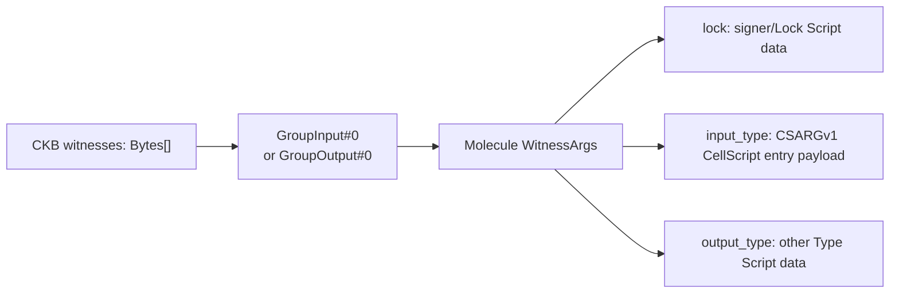

# CellScript 0.23 Roadmap

**Status**: Draft, pending release-line coordination before adoption
**Scope**: one Edition 2026 compatibility contract, canonical CKB
`WitnessArgs.input_type` entry placement, public registry production deployment
on `cellscript.dev`, completed native test/fixture tooling, deeper RGB++ / Fiber
integration, and a Myelin-aligned Off-Chain Session Runtime profile with initial
concurrency support
**Depends on**: the 0.22 typed transaction views, bounded collections, stable
`E2xxx` diagnostics, the existing `cellscript-fiber-adapter` no-profile path,
the implemented `services/registry-api` write boundary, the production
boundary ADR, and the Myelin Session L2 plan

## Goal

0.23 is the first CellScript release whose headline is *operational* rather
than language-theoretic. 0.22 closed the first slice of the type/set roadmap
and the bounded Fiber path; 0.23 turns those compiler facts into a running
public package registry, drops Python from the project's tooling contract,
pushes RGB++ / Fiber further toward production, and introduces a new
Off-Chain Session Runtime profile so that the Myelin vendored fork can stop
diverging.

The four pillars below are independent enough to be tracked as separate work
packages, but they share one discipline: every claim must remain tied to
compiler evidence or builder-backed chain evidence, and every "production"
word must distinguish *deployed and observed* from *gated and certified*.

This is a draft roadmap, not an implementation contract. It must be matched
against `CHANGELOG.md`, the release gate, and any in-flight branch before
adoption.

## Completed Release-Line Foundation: Edition 2026 And Entry Witness ABI

Before the four operational pillars, 0.23 closes two compiler-wide contracts
that every later package and builder depends on.

### One Edition Contract

Edition 2026 is the first and only CellScript edition. Every package declares
`edition = "2026"`; missing or different values fail during manifest parsing.
There is no migration command, implicit alternate edition, or compatibility
parser because no published CellScript ecosystem needs one.

The edition resolves a complete compatibility profile from source semantics,
the selected target profile, primitive assurance, entry-payload encoding, and
CKB witness placement. The compiler emits that profile in metadata and hashes
it into registry records, `Cell.lock`, `Deployed.toml`, compile receipts, and
generated action builders. A tool cannot change one part of the contract while
continuing to claim the same build identity.

The same edition value crosses every compiler consumer:

- CLI package commands read it from `Cell.toml`;
- standalone and in-memory compiler calls use the current edition explicitly;
- LSP-loaded modules carry the edition into compilation;
- WASM exports require the caller to pass `"2026"`; and
- the website worker and generated TypeScript bindings pass and report the same
  value.

### Canonical Entry Witness Placement

The entry payload keeps the self-identifying `cellscript-entry-witness-v1`
format (`CSARGv1\0` plus positional arguments), but Edition 2026 gives it one
CKB placement:



The generated entry wrapper first loads `GroupInput#0`; for an output-only
script group it uses `GroupOutput#0`. It validates the Molecule table and the
`BytesOpt` field before decoding `input_type`. A raw `CSARGv1` payload, malformed
table, absent `input_type`, or payload placed in `lock`/`output_type` fails
closed with runtime error 25. Builders preserve the other two fields and reject
an occupied `input_type` instead of silently overwriting it.

This removes the former ambiguity between two byte layouts without inventing a
CellScript-specific replacement for CKB's shared Witness convention.

### Persisted Identity Cut

Because no ecosystem migration is required, 0.23 accepts only the new identity
set:

- compile metadata schema 56 with source schema 2, artifact schema 1, and
  constraints schema 2;
- `Cell.lock` version 2;
- `Deployed.toml` version 2 with
  `cellscript-deployed-v0.23-edition-2026`;
- edition-bound compile receipts and generated action builders; and
- registry build records with a required compatibility-profile hash.

Readers reject missing, mismatched, or superseded identities. They do not
reinterpret them under Edition 2026.

### Acceptance Boundary

The foundation is complete only when manifest parsing, compile metadata,
artifact verification, registry resolution, lock/deployment checks, CLI, LSP,
WASM, website bindings, entry-wrapper codegen, builders, examples, and docs all
agree. Valid and invalid CKB-VM fixtures must cover canonical
`WitnessArgs.input_type`, malformed offsets, absent fields, raw-payload
rejection, and output-only group selection. NovaSeal live and planned-profile
devnet constructors must use the same placement rather than maintaining a
release-only raw-witness path. Routine merge evidence is `dev` and `ci`; because
witness placement changes generated RISC-V, the clean-tree `backend` gate
remains required before a production claim.

Source documents:

- [0.23 development release notes](../docs/releases/CELLSCRIPT_0_23_RELEASE_NOTES.md)
- [CellScript Edition Policy](../docs/CELLSCRIPT_EDITION_POLICY.md)
- [Entry Witness ABI](../docs/CELLSCRIPT_ENTRY_WITNESS_ABI.md)
- [Metadata verification tutorial](../docs/wiki/Tutorial-06-Metadata-Verification-and-Production-Gates.md)

## Pillar 1: Public Registry Production Deployment

The registry is the largest 0.23 feature. The write API (`services/registry-api`)
is already implemented to the boundary described in
[`docs/CELLSCRIPT_REGISTRY_PRODUCTION_BOUNDARY_ADR.md`](../docs/CELLSCRIPT_REGISTRY_PRODUCTION_BOUNDARY_ADR.md):
JoyID-rooted capability authorisation, scoped capability keys, namespace claim
cooldown, R2 source snapshots, Neon Postgres state, static `/packages/*` read
path, idempotent publish, and admin-gated status transitions. The 0.23 work
is to actually deploy it on `cellscript.dev` and to wire the frontend and CLI
into the same trust model.

The Edition 2026 contract slice is complete: publish protocol v2 and registry
schema 2 are a hard cut across the Rust publisher/reader, API validation,
Postgres schema, R2 package-version object, checked-in registry fixture, and
website data model. There is no schema-1 compatibility path. Generic admin
status changes cannot create `verified_build` or `deployed` claims; an
evidence-specific promotion path remains production work.

### Production Domains And Hosting

```text
cellscript.dev                -> Astro site (Cloudflare Pages) + playground
registry.cellscript.dev       -> static/CDN read path backed by R2 objects
api.registry.cellscript.dev   -> authenticated Cloudflare Worker write API
```

The site stays static where it can and only the write path is dynamic.
Ordinary package reads never touch Hyperdrive or the write store; the
`/packages/:namespace/:name/versions/:version.json` route is served from R2
with CDN cache headers.

### Scope

- Stand up `services/registry-api` on Cloudflare Workers against a real Neon
  Postgres instance through Hyperdrive, with the `REGISTRY_ADMIN_TOKEN`,
  Hyperdrive, and R2 bindings configured as secrets/bindings rather than in
  `wrangler.toml`.
- Provision the two R2 buckets (`REGISTRY_OBJECTS`, `SOURCE_SNAPSHOTS`) and
  the static `/packages/*` write-before-admit path described in the ADR.
- Bring the staging slice (`staging-registry.cellscript.dev`) up first; the
  production slice is cut over only after staging has run the acceptance
  scenarios end to end.
- Wire the Astro frontend (the existing `website/src/pages/registry*` surface
  and `RegistryLayout.astro`) to the live read path so the website renders
  real registry entries instead of the static
  `website/src/data/registry-packages.json` snapshot.
- Replace the website publish page with a real JoyID/CCC-backed submit flow
  that signs `cellscript-registry-auth-v1` capability payloads through the
  CCC JoyID CKB signer and posts them to `/v1/capabilities`.
- Keep the existing `npm run prepare:registry` regeneration as a fallback
  fixture path; it must not become the read authority for the production
  site.

### CLI Alignment

- Make bare `cellc publish` hit the production write API by default, while
  keeping `--offline` and the Git/`registry.json` path as explicit audit and
  fallback modes.
- Verify `cellc auth capability create/submit/revoke` against the deployed
  Worker end to end, including the JoyID signature verification, capability
  key persistence in the OS keychain, and CI signing via
  `CELLSCRIPT_CAPABILITY_PRIVATE_KEY_PKCS8_B64`.
- Confirm idempotency (`Idempotency-Key`, `x-idempotency-status: replayed`),
  nonce consumption ordering, and the fail-fast-before-object-storage rule
  against the live Worker.
- Ensure `cellc install`/`cellc update` resolve against
  `registry.cellscript.dev` by default and keep hash-first verification
  (source hash, manifest hash, build identity) intact.

### Acceptance Boundary

Production-readiness for the registry means all of:

- staging runs the full positive and negative publish flow (capability
  creation, JoyID signature, namespace claim cooldown, publish, replay,
  revoke, quarantine, yank);
- the static read path survives a write-store outage (packages remain
  readable from R2);
- existing package versions are rejected before source snapshot writes;
- per-IP/ASN/principal/capability/namespace/package quotas behave under
  forged-payload, replay, and burst tests;
- the admin audit log records every capability, namespace, publish, and
  override transition with an attributable actor;
- the first real CellScript source package is published through the
  production flow and resolves on a clean machine via `cellc install`.

The existing `services/registry-api` typecheck, unit suite, and dry-run Worker
build run in the unified `ci` gate as the local contract baseline. Deployed
end-to-end coverage still belongs in a staging scenario harness; local compiler
CI is not Cloudflare/R2/Hyperdrive/Neon evidence.

### Non-Goals

- No on-chain deployment record submission in the first slice. On-chain
  attestation uses the same identity model but is feature-gated and must not
  be mixed into the first write API.
- No bond or refundable deposit mechanism; the schema leaves `policy_hooks`
  and `bond_policy_hooks` for later.
- No non-`joyid_ckb` publisher principals.
- No D1 as primary database.

Source documents:

- [Registry production boundary ADR](../docs/CELLSCRIPT_REGISTRY_PRODUCTION_BOUNDARY_ADR.md)
- [Registry Phase 1 walkthrough](../docs/CELLSCRIPT_REGISTRY_PHASE1.md)
- [Registry API service README](../services/registry-api/README.md)

## Pillar 2: Native Tooling Migration Complete

CellScript's load-bearing tooling is now Python-free. Gate, evidence, and
proposal logic lives in Rust; Astro-facing website data generation stays in
the website's native Node runtime.

### Implemented Scope

- `crates/cellscript-tools` owns strict backend and syntax-combination audits,
  repository checks, release validators, CKB acceptance, NovaSeal fixtures,
  external-evidence adapters, Fiber experiments, and live/stateful runners.
- `proposals/novaseal/tools` owns NovaSeal package-local vector, schema, ABI,
  audit-surface, and fixture harnesses.
- `proposals/evolving-dob/evolving-dob-profile-v1/tools` owns registry pressure
  and devnet workflow validation.
- `website/scripts/*.mjs` owns registry, compiler-output, and GitHub activity
  data generation without introducing a second runtime into the Astro build.
- `scripts/cellscript_gate.sh` invokes only Rust, shell, and Node tooling. The
  retired syntax-check arm and all tracked interpreter sources have been
  removed; a repository-wide native source policy prevents reintroduction.
- Evidence producers preserve their established JSON shape where it remains
  part of the release contract; implementation-origin fields now truthfully
  identify the Rust harness and transaction-recipe replay path.
- Profile-operator fixture generation accepts an explicit evidence root, and
  its integration coverage constructs isolated reports instead of depending
  on stale developer-machine files below `target/`.

### Acceptance Boundary

- `./scripts/cellscript_gate.sh dev` and `ci` pass with only the declared Rust,
  shell, and Node runtimes.
- Deterministic static reports remain byte-stable for the same inputs; live
  reports preserve their schemas while binding fresh devnet transactions.
- The NovaSeal verifier pinning check still recomputes BLAKE2b and SHA-256
  over the same ELF and compares against the same `Cell.toml` and
  `proofs/*.template.json` hashes.
- The proposal submodules keep their evidence roots intact; only the driver
  language changes.

### Non-Goals

- No rewrite of the compiler, the gate script's bash orchestration, or the
  CKB acceptance harness's bash wrappers. The migration changes the native
  tooling implementation, not those orchestration boundaries.
- No change to the evidence schema or file naming.
- No dropping of historical evidence files; the ports must keep reading
  them.

Source documents:

- [Coding style](../CODING_STYLE.md) — tooling and gate contract
- [Gate policy](../docs/CELLSCRIPT_GATE_POLICY.md) — mode semantics
- [`scripts/cellscript_gate.sh`](../scripts/cellscript_gate.sh)

## Pillar 3: RGB++ And Fiber Integration

0.22 shipped a narrow, no-profile Fiber path: the dedicated
`fungible-type-group-v1` compiler entry, the `cellscript-fiber-adapter`, and
bounded local-devnet scenarios. Phase 5 (gate promotion and optional hot
loading) and the full external lifecycle/negative matrix remain pending.
0.23 does not declare Fiber production-ready; it closes the next set of
concrete integration gaps.

### Fiber Scope

- Close the pinned complete external lifecycle/negative matrix. The current
  evidence is bounded devnet runs (Fiber `04e091b...`, Bruno 1.20.0
  watchtower collection); the missing rows are the declared full matrix,
  not a representative sample.
- Promote the standalone Fiber harness (`scripts/cellscript_fiber_acceptance.sh`)
  from non-gating to a release-mode gate once the matrix is complete and
  reproducible. Until then it stays standalone.
- Address the restart-required operator burden: the adapter must continue to
  generate a deterministic overlay and report
  `LocalNodeConfiguredRestartRequired`. Any future hot-load RPC must be
  capability-detected and explicitly optional; no unsupported Fiber RPC is
  assumed.
- Extend the `fungible-type-group-v1` contract conservatively. Any new
  authority mode, witness shape, or data layout must keep the fail-closed
  diagnostic surface and must not silently widen the structural-compatibility
  predicate by name-matching (`token`, `transfer`, `fiber`, `amount`,
  `xudt`).

### RGB++ Scope

RGB++ stays outside `std::*`. 0.22 only shipped a non-production
`examples/ecosystem/rgbpp-identity-adapter`. 0.23 advances the ecosystem
adapter track from the [Spore/RGB++ interop plan](CELLSCRIPT_SPORE_RGBPP_INTEROP_PLAN.md):

- Pin RgbppLock, BtcTimeLock, BTC SPV, witness/commitment, confirmation, and
  deployment identities before any protocol-level promotion.
- Keep Bitcoin orchestration in the builder/service layer; the compiler
  surface continues to bind one transfer-shaped input/output pair to exact
  Type Script code hash, hash type, and args.
- Add CKB plus Bitcoin-side fixtures together; no Spore-over-RGB++ combined
  fixture until both independent adapters pass their own promotion gates.
- Treat the active `RGBPlusPlus/rgbpp-sdk` as the only normative source. The
  early design repository remains background, not ABI.

### Acceptance Boundary

- The Fiber full matrix is content-addressed: every completed row references
  a non-empty regular file under an explicit evidence root with its CKB
  Blake2b-256 digest; the validator rejects absolute paths, parent
  traversal, symlinks, missing files, and hash mismatches.
- Operator authentication and reproducible Fiber binary provenance remain
  separate release obligations; closing the matrix is necessary but not
  sufficient for a production-readiness claim.
- RGB++ work ships as a package/adapter slice, not as core namespace
  surface, and must carry reproducible external fixtures and reorg/finality
  assumptions before promotion.

### Non-Goals

- No Fiber-specific profile language (`fiber-profile.json`, `[fiber]` in
  `Cell.toml`, `#[fiber_asset]`, etc.). The no-profile rule from 0.22 is
  preserved.
- No embedding of the CellScript compiler into a Fiber node.
- No claim that the SHA-256 / SHA256d / Merkle helpers implement Bitcoin
  SPV. Header chains, PoW/difficulty, confirmations, and reorg policy belong
  to a separately pinned Bitcoin SPV package.

Source documents:

- [0.22 Fiber native-support plan](CELLSCRIPT_0_22_FIBER_NATIVE_SUPPORT_PLAN.md)
- [Spore/RGB++ interoperability plan](CELLSCRIPT_SPORE_RGBPP_INTEROP_PLAN.md)
- [Signature verifier ABI](../docs/CELLSCRIPT_SIGNATURE_VERIFIER_ABI.md)

## Pillar 4: Off-Chain Session Runtime Profile (Myelin Alignment)

The Myelin repository vendors a copy of CellScript at
`/Users/arthur/RustroverProjects/Myelin/cellscript`, currently pinned at
`0.21.1`. It has already diverged: the workspace members differ, the
vendored fork is behind the 0.22 type/set surface, and Myelin's own session
L2 plan calls for a court-facing `CkbStrict` VM profile and a finite session
ledger whose disputed chunks project into CKB-compatible replay. 0.23
absorbs the language-side needs of that plan so Myelin can stop carrying a
private fork.

### Scope

Introduce an `Off-Chain Session Runtime` target profile in the CellScript
compiler that gives Myelin (and any other bounded off-chain session runtime)
a first-class, fail-closed compilation entry for session-shaped contracts.
The profile is opt-in and does not change the default CKB profile.

The profile's initial deliverables:

- A new target profile metadata entry, distinct from the existing `ckb`
  profile, that records:
  - `vm_profile` (e.g. `ckb_strict` vs `myelin_extended`);
  - session commitment shape (`SessionId`, `ChunkCommitment`,
    `DisputeBundle`, `SettlementIntent` references, not values);
  - whether the artifact is court-facing or off-chain-only;
  - whether concurrency is permitted.
- A bounded concurrency primitive surface for the off-chain path only. This
  is the *initial* concurrency support: a finite, scheduler-visible set of
  session-scoped operations whose semantics are well-defined under Myelin's
  session model (ordered chunk commitments, deterministic state-root
  transitions, scheduler commitments). It is **not** a general
  threading/actor model and does not enter the CKB profile.
- A fail-closed rule: any artifact compiled under the Off-Chain Session
  Runtime profile that is later projected into a CKB court path must
  recompile under `ckb_strict` and must not carry `MyelinExtended` semantics
  unless the projection layer explicitly proves compatibility.
- Compiler metadata and `cellc explain-*` output that distinguish
  court-facing from off-chain-only artifacts, so auditors can tell which
  profile an artifact was built under.

### Myelin Re-Convergence

After the profile lands in upstream CellScript:

- Myelin drops its vendored fork and consumes the published CellScript
  release as a normal dependency.
- The Myelin Session L2 P0 skeleton (`SessionOpen`, `ChunkCommitment`,
  `DisputeBundle`, `SettlementIntent`) consumes the new profile instead of
  patching the compiler.
- The `CkbStrict` default for court-facing execution becomes a CellScript
  profile fact, not a Myelin-local deviation.
- Legacy group-source encoding and other deviations recorded in
  `MYELIN_CKB_SEMANTIC_DEVIATIONS.md` move into the upstream profile contract
  or are removed.

### Acceptance Boundary

- The Off-Chain Session Runtime profile is parser/type/lowering/metadata/
  codegen/LSP/docs gated just like any other target profile.
- The concurrency surface is bounded: every permitted concurrent operation
  has a documented scheduler contract, a deterministic replay story, and a
  fail-closed fallback when the host runtime does not provide it.
- No `MyelinExtended` artifact may claim CKB court compatibility without an
  explicit projection proof in metadata.
- The Myelin Teeworlds fixture still finalises with both the static
  committee and Tendermint and produces identical state-transition
  commitments but different finality evidence.

### Non-Goals

- No general `channel` or session-type syntax in the core language. The 0.22
  type/set roadmap already defers this; 0.23 keeps it deferred.
- No independent app-chain features for Myelin: block production, P2P
  gossip, fork choice, validator-set lifecycle, slashing, fee markets, or
  app-chain governance stay out of scope, matching the Myelin Session L2
  plan.
- No implicit promotion of off-chain semantics onto the CKB court path.

Source documents:

- [Myelin Session L2 plan](../../Myelin/MYELIN_SESSION_L2_PLAN.md)
- [Myelin CKB semantic deviations](../../Myelin/MYELIN_CKB_SEMANTIC_DEVIATIONS.md)
- [Myelin production gate](../../Myelin/MYELIN_PRODUCTION_GATE.md)
- [0.22 type/set roadmap (session-type deferral)](CELLSCRIPT_0_22_TYPE_AND_SET_THEORY_ROADMAP.md)

## Cross-Cutting Discipline

0.23 does not relax any existing project contract:

- Trailing-whitespace, native source-policy, and `git diff --check` gates still
  apply. Native tooling changes must re-run `cargo fmt` and fix whitespace.
- The website build still regenerates
  `website/src/data/registry-packages.json` and fails if it is dirty in the
  working tree; if the production registry changes what gets regenerated,
  commit the result.
- The wasm bundle size budget (600 KB gzip) still holds. Any compiler
  surface added for the Off-Chain Session Runtime profile must be gated so
  the `wasm32-unknown-unknown` playground build does not pull native-IO or
  concurrency deps.
- Release notes continue to separate highlights, scope boundaries,
  validation commands, and detailed docs. Roadmap promises stay out of
  `docs/` and in `roadmap/`.
- The `rust-version = "1.97.1"` pin, the exact-version dependency pins
  (`indexmap`, `clap`, `ckb-vm`, etc.), and the pinned toolchain are not
  bumped without coordinating with the release gate.

## Sequencing

The four pillars are largely independent and can be tracked as parallel
work streams. Suggested ordering for *release-blocking* slices:

1. Pillar 2 (native tooling migration) lands first, because it changes the
   shape of the gate itself and every later pillar's evidence runs through
   that gate.
2. Pillar 1 (registry production) lands next, because it unblocks real
   package publishing for everything else.
3. Pillar 4 (Off-Chain Session Runtime profile) lands next, because Myelin
   re-convergence depends on it and it is the riskiest compiler change.
4. Pillar 3 (RGB++ / Fiber) lands last, because it is the most
   evidence-bound and the least likely to be fully "done" in one release;
   partial closure with an explicit pending matrix is acceptable.

## Risk Register

- **Registry production cut-over**. The write API is implemented but has
  only run locally and in tests. The first real deployment may surface
  Hyperdrive/R2/Neon integration issues that the test suite does not cover.
  Mitigation: staging-first, fail-fast-before-object-storage, full admin
  audit log.
- **Native tooling serialization drift**. A subtle difference in
  evidence-report formatting breaks historical comparisons. Mitigation:
  byte-identical output requirements, stable schemas, and regression vectors.
- **Off-Chain Session Runtime scope creep**. The profile can easily grow
  into a general concurrency model. Mitigation: bounded scheduler-visible
  operations only, fail-closed when the host does not provide them, no
  core-language channel/session syntax.
- **Fiber full matrix never closing**. The matrix is large and depends on an
  external Fiber binary. Mitigation: keep the harness standalone and
  non-gating until the matrix is complete; release 0.23 with an explicit
  pending matrix rather than blocking on it.
- **Myelin re-convergence slip**. If the profile lands late, Myelin keeps
  diverging. Mitigation: land the profile early in the cycle and cut a
  CellScript release that Myelin can consume even if the other pillars slip
  to 0.24.

## Roadmap Discipline

This entry follows the same rules as the rest of the roadmap:

- completed work points to tests, release notes, or evidence reports;
- deferred work says why it is deferred;
- security-sensitive surface distinguishes data source from authority;
- CKB production claims distinguish compiler evidence from chain evidence;
- no feature is described as implemented until parser, type checking,
  lowering, metadata, LSP/editor behaviour, tests, examples, and docs agree
  on the same boundary.
